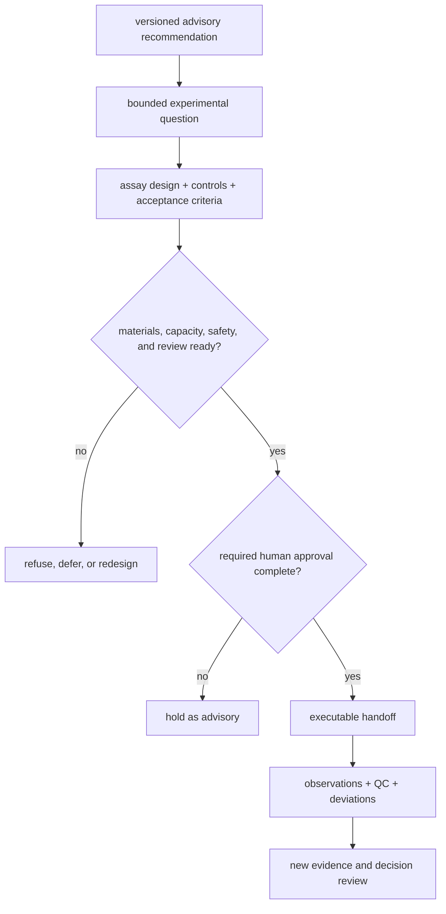
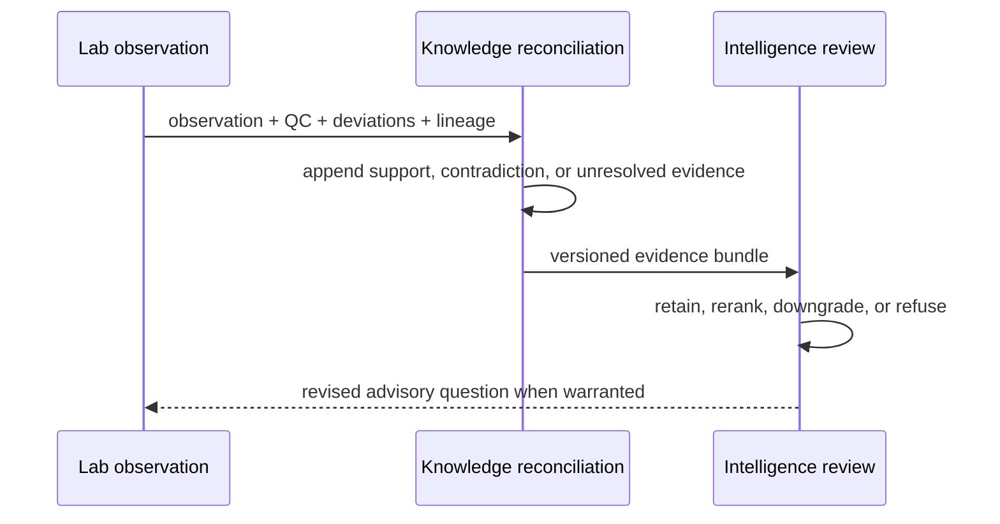

# Lab Consequence

Laboratory consequence asks whether an advisory recommendation can become a
safe, controlled, and informative experiment. Scientific support and ranking
confidence are inputs to that decision; neither authorizes execution. Lab
readiness also depends on controls, materials, instrumentation, staffing,
sample burden, expected information gain, and explicit human approval.

## From Recommendation To Handoff

An executable handoff is versioned and immutable in meaning. If evidence,
design, controls, or resources change, create a revised plan rather than
silently altering the approved record.

## Consequence Record

A reviewable consequence packet identifies:

| Field | Required content |
| --- | --- |
| decision lineage | recommendation, evidence bundle, scientific result, and policy identities |
| experimental question | result that can strengthen, weaken, or leave the claim unresolved |
| assay and sample design | targets, matrix, cohort, replicates, randomization, and exclusions |
| controls | positive, negative, process, calibration, carryover, and contamination controls as applicable |
| readiness | materials, instrument, method, staffing, scheduling, safety, and review state |
| burden | sample consumption, run time, cost, analyst time, and opportunity cost |
| acceptance and stop rules | measurable success, failure, inconclusive, and refusal conditions |
| output contract | observations, QC, deviations, artifact identities, and uncertainty |
| authority | required human approvals and custody transfer |

Feasibility answers “can this work be performed under the declared controls?”
It does not answer “is this the best scientific action?” Expected information
gain and opportunity cost remain part of the review.

## Family Consequence Limits

| Family | Reviewable follow-up | Consequence that remains bounded |
| --- | --- | --- |
| `dda` | investigate identification or inference differences using preserved engine context | imported search execution and control burden prevent a universal rerun claim |
| `dia` | test library-conditioned absence, interference, or matrix sensitivity | absent-peptide interpretation and chromatogram-native evidence remain limited |
| `lfq` | repeat or extend cohort contrasts under explicit normalization and missingness policy | transfer across cohorts and analytical policies remains uncertain |
| `multiplex` | inspect channel assignment, reference design, interference, and batch connectivity | outsider-facing consequence evidence is not closed; support remains internal |
| `ptm` | challenge localization or measure a bounded site-level follow-up | localization does not establish occupancy, function, or causal regulation |
| `targeted` | assess transitions, calibration, interference, carryover, and matrix suitability | method transfer and assay burden can still reverse the recommendation |

## Refuse Before Execution

Refuse, defer, or redesign when the question is not falsifiable, required
controls are absent, sample identity or custody is unresolved, material or
instrument conditions cannot satisfy the contract, expected information gain
does not justify burden, or required review is incomplete.

Use the [Workflow Refusal Handbook](workflow-refusal-handbook.md) to distinguish
stop, rerun, narrow, and refuse decisions. A refusal is an auditable outcome;
it should name the failed condition and the evidence required to reconsider.

## Compare Requested And Observed Work

After execution, record the requested and observed assay, controls, samples,
instrument and method identity, QC, deviations, terminal state, artifacts,
failure class, and uncertainty. Do not convert a technically clean observation
directly into a biological conclusion.

[Outcome Learning Loops](outcome-learning-loops.md) defines how observations
return to Knowledge and Intelligence. The observation becomes new evidence;
the original recommendation and handoff remain preserved for calibration and
regret review.

## Continue The Review

- [Decision Support](../../01-bijux-proteomics/foundation/decision-support.md)
  traces the limiting owner before a handoff reaches Lab.
- [Workflow Consequence Maps](../../01-bijux-proteomics/foundation/workflow-consequence-maps.md)
  compares consequence posture across all workflow families.
- [Current Capability Limits](../../01-bijux-proteomics/foundation/current-capability-limits.md)
  records the evidence needed before a stronger public claim can be made.
