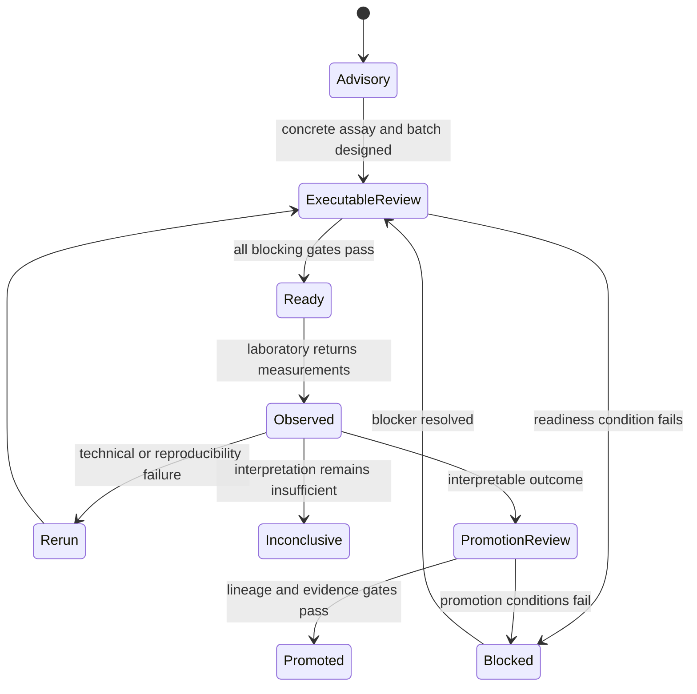

# Lifecycle Overview

The lab lifecycle separates scientific desirability, operational readiness, physical execution, outcome interpretation, and evidence promotion. Each transition has its own gate because success at one stage does not imply success at the next.

## Planning lifecycle

Advisory plans translate evidence gaps into scientifically motivated assays and remain explicitly non-executable. Executable plans bind instructions to batches, samples, objectives, blockers, and preflight checks. Readiness then evaluates live capacity, instruments, materials, staffing, budget, controls, provenance, evidence, and backlog.

## Assay lifecycle

Assays can move from discovery through verification and validation to targeted follow-up. Advancement records completed stages, blocking findings, required transition evidence, reasons, next actions, and an audit trail. Targeted transitions may be approved, exploratory, or refused according to feasibility, reproducibility, uniqueness, localization, failure risk, and available controls.

## Outcome lifecycle

Returned observations retain units, replicates, dispersion, normalization, detection-limit censoring, QC, batch-effect concerns, and interpretation confidence. Outcomes distinguish biological failure, technical failure, reproducibility failure, and inconclusive evidence; rerun policy follows that classification.

Promotion to knowledge is a separate reviewed transition. Negative and failed outcomes can still be evidence, but their failure class and lineage must survive promotion.
