# Package Overview

`bijux-proteomics-lab` owns assay consequence: readiness checks, control
demands, material and queue burden, handoff honesty, and the observed outcomes
that later tighten the upstream story. The package is only healthy when those
downstream decisions stay distinct from scientific truth, recommendation
policy, and runtime execution control.

```mermaid
flowchart LR
    gap["evidence gap or recommendation"]
    advisory["advisory assay plan"]
    design["controls · samples · dependencies"]
    readiness["materials · instrument · staff\ncost · queue · provenance"]
    authority["laboratory authorization"]
    handoff["frozen executable handoff"]
    observation["external execution observations"]
    promotion["promotion, rerun, narrow, or stop"]
    gap --> advisory --> design --> readiness --> authority --> handoff --> observation --> promotion
```

Each arrow can stop. A scientifically useful assay can be operationally
unready; an operationally ready plan can remain unauthorized; a completed run
can produce an inconclusive or non-promotable observation. Those stops are
first-class outcomes, not missing workflow polish.

## Owned Consequence Surfaces

| Owner surface | Contract | Why it matters |
| --- | --- | --- |
| `planning` | assay planning, material needs, and experimental route shaping | a promising idea becomes a priced and staged follow-up instead of a slogan |
| `readiness` | control demand, queue discipline, and preflight burden | the repository can say when a follow-up is not yet ready |
| `handoffs` | lab-facing bundle preparation and honest downstream instructions | analytical confidence becomes actionable without turning into hidden tribal knowledge |
| `design` | experimental design-facing structures | controls and comparison logic stay explicit |
| `benchmarks` | rehearsal and benchmark-facing lab surfaces | public evidence can be stress-tested against follow-up reality |
| `outcomes` and `reconciliation` | requested-versus-observed outcome capture and closure loops | later trust language can narrow because of what actually happened |
| `lifecycle` | consequence state transitions | follow-up burden and refusal state stay durable |

## What It Owns

- plan assay work with explicit burden, readiness, and control requirements
- capture observed outcomes against requested work and blocked work alike
- publish honest handoffs, refusal surfaces, and follow-up consequence records
- preserve the gap between "analytically attractive" and "worth real assay
  spend now"

## What Readers Commonly Underestimate

- this package is where queue or material burden becomes a release boundary,
  not just a project-management detail
- this package decides whether downstream execution is justified, not merely
  whether it is technically possible
- this package makes observed outcomes part of later scientific judgment
  instead of leaving them as isolated run notes

## Audit A Proposed Follow-Up

| Review question | Evidence required |
| --- | --- |
| What uncertainty would the assay resolve? | named evidence gap, proposed observation, and decision consequence |
| Is the design scientifically discriminating? | contrast, controls, replication, randomization, censoring and failure criteria |
| Is the batch operationally ready? | material, instrument, staffing, queue, cost, provenance, and control findings |
| Who authorized execution? | named authority, approved plan identity, rationale, and unresolved warnings |
| What was actually observed? | raw replicate values, units, QC, normalization, dispersion, censoring, lineage |
| Can the outcome enter knowledge? | promotion verdict, evidence identity, support limits, and contradiction impact |

## What It Refuses

- evidence truth or contradiction resolution
- recommendation policy or ranking posture
- general execution orchestration, replay, or provider control

## Continue By Consequence

| Need | Read next | Review closes when |
| --- | --- | --- |
| separate recommendation from executable work | [Planning and outcome contracts](../interfaces/data-contracts.md) | advisory and executable identities, gates, and authority are distinct |
| inspect readiness and lifecycle transitions | [Execution model](../architecture/execution-model.md) | blockers, authorization, handoff, observation, and promotion form one history |
| determine the claim ceiling after follow-up | [Lab consequence](lab-consequence.md) | requested and observed work, QC, uncertainty, and downstream sentence agree |
| interpret a non-confirming result | [Outcome learning loops](outcome-learning-loops.md) | technical, biological, reproducibility, and inconclusive outcomes remain distinct |
| refuse unjustified spend | [Workflow refusal handbook](workflow-refusal-handbook.md) | the failed condition and evidence required to reconsider are explicit |
