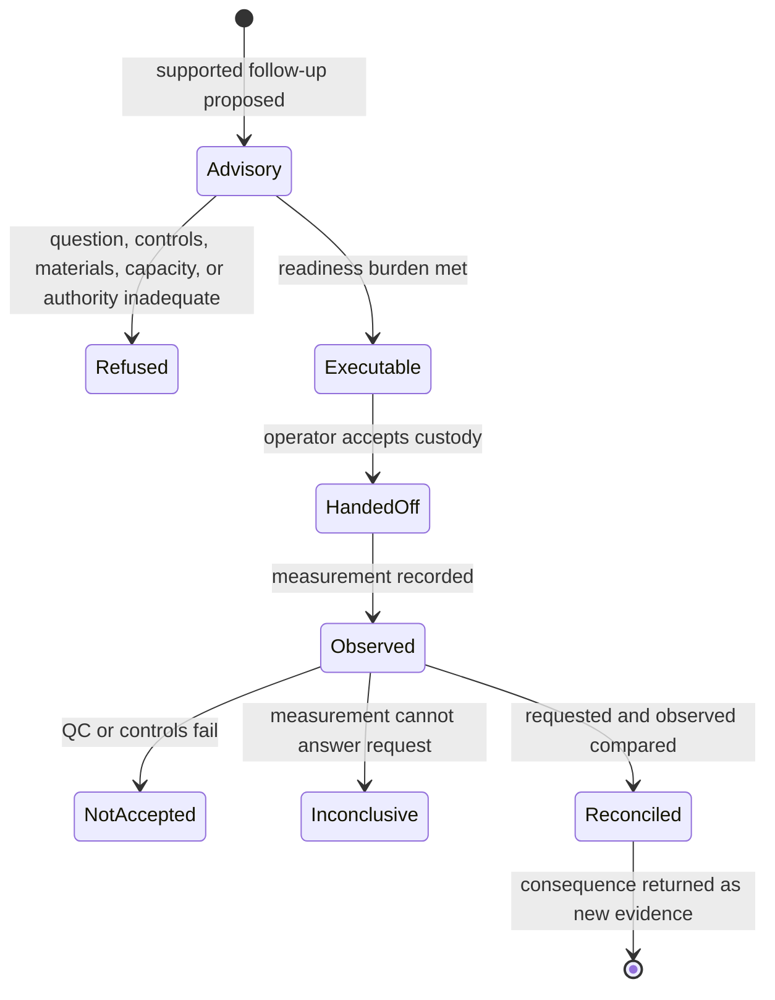

# Repository fit

Lab owns the boundary where an advisory scientific action becomes controlled
physical work and where that work returns an observation. The package exists
separately because feasibility, materials, controls, custody, deviations, and
outcomes carry authority that neither analytical computation nor general
software execution can supply.

## Why a separate package exists

An accepted scientific result can still lead to an unanswerable assay. A stable
recommendation can still be too costly, unsafe, underspecified, or impossible
under current capacity. A technically completed experiment can still fail QC
or remain biologically inconclusive. Lab makes each of those states explicit
rather than collapsing them into success or failure.

## Owned surfaces

| Surface | Lab responsibility |
| --- | --- |
| `design` | experiment and protocol contracts, controls, materials, and acceptance criteria |
| `planning` | advisory and executable plans, priorities, queues, batches, schedules, and next-cycle work |
| `readiness` and `lifecycle` | progression checks, refusal, and governed state movement |
| `handoffs` | exact instructions, risks, artifacts, acknowledgement, and custody |
| `outcomes` | measurements, QC, deviations, failures, and evidence feedback |
| `reconciliation` | requested-versus-observed comparison and follow-up disposition |
| `benchmarks` | rehearsals and consequence evidence for the Lab-owned contract |

## Placement test

Ask whether the disputed rule depends on the physical and operational context
of a proposed assay.

| Rule depends on… | Owner |
| --- | --- |
| scientific meaning or analytical acceptance | Core |
| evidence source, context, or contradiction | Knowledge |
| decision values, ranking, or recommendation posture | Intelligence |
| generic software execution and artifact transport | Runtime |
| assay answerability, controls, materials, capacity, custody, QC, or observed consequence | Lab |

Lab may consume every upstream record in this table. It cannot promote an
observation into biological support without Knowledge reconciliation or turn a
Lab disposition into a new recommendation without Intelligence review.

## What does not fit

- generic workflow orchestration unrelated to laboratory custody;
- recommendation ranking hidden inside scheduling priority;
- evidence reconciliation performed while recording an observation;
- readiness inferred from a completed analytical run;
- successful status that omits failed controls, deviations, consumed material,
  or answerability;
- rewriting a plan after execution so it appears to match the outcome.

## Fit tests

Lab remains coherent when an independent reviewer can reconstruct what was
requested, why it was considered ready, who accepted custody, what was actually
measured, which controls and deviations applied, and how the observation was
returned for evidence review. Refusal and inconclusive outcomes are valid
records, not incomplete success paths.

Continue with the [custody chain](../index.md#custody-chain),
[readiness and refusal](../index.md#readiness-and-refusal), and
[outcome interpretation](../index.md#interpret-the-outcome-safely).
