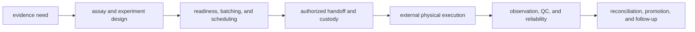

# Scope and non-goals

`bijux-proteomics-lab` owns the contracts that turn an evidence need into
reviewed laboratory work and return the observed consequence. It does not
operate physical instruments or own the scientific and decision policies that
precede and follow that work.

## Owned lifecycle

The package owns the solid-arrow records around external execution: design,
dependencies, readiness, queueing, scheduling, authority, custody, export,
observation intake, QC, failure classification, reconciliation, and promotion
posture.

## Explicit non-goals

| Not owned here | Responsible boundary |
| --- | --- |
| physical instrument control, acquisition software, or bench automation | laboratory systems and operators outside this Python package |
| generic repository workflow execution and run-state infrastructure | Bijux Proteomics Runtime |
| scientific transformations, scoring, quantification, and workflow-family acceptance | Bijux Proteomics Core |
| source, citation, claim, and contradiction custody | Bijux Proteomics Knowledge |
| ranking, recommendation, sensitivity, regret, and advisory policy | Bijux Proteomics Intelligence |
| shared identifiers, outcomes, canonical serialization, and migration primitives | Bijux Proteomics Foundation |
| repository policy, CI, release, and documentation automation | Bijux Proteomics Maintain |

## Boundary rules

- an advisory plan remains non-executable until readiness and authority are
  recorded for a concrete batch;
- an authorized handoff records intended work but does not claim that physical
  execution occurred;
- an observation records what returned and does not imply QC acceptance;
- an accepted assay does not automatically become promoted evidence;
- promotion appends a downstream disposition and never rewrites the plan or
  observation;
- failures, refusals, deviations, and inconclusive results remain first-class
  outcomes.

Use the [execution model](../architecture/execution-model.md) for the state
machine and the [operator workflow](../interfaces/operator-workflows.md) for
the end-to-end handoff and return path.
