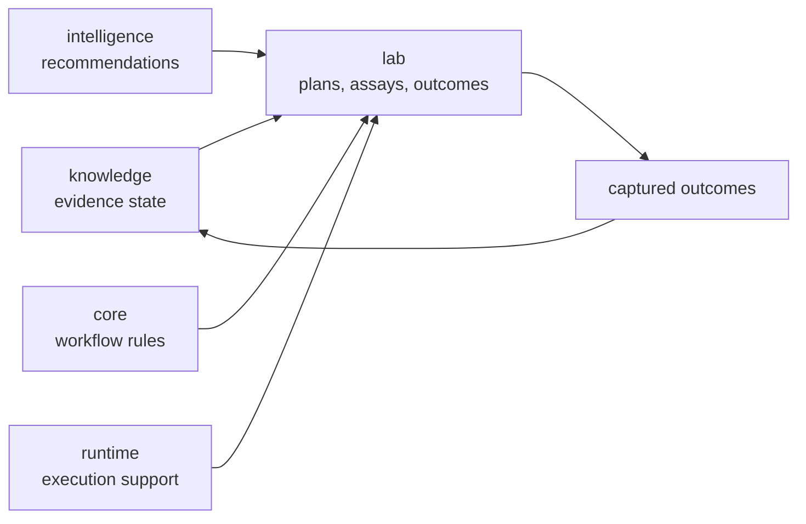

# bijux-proteomics-lab

`bijux-proteomics-lab` owns lab-facing execution in `bijux-proteomics`. It
turns plans and decisions into assay work, captures outcomes, and keeps
experiment-facing state separate from lower-layer contracts and runtime control.
This is where the repository stops being only a reasoning system and becomes a
practical instrument for experimental action.

## Why This Package Exists

- recommendation only matters if it can survive contact with real assays
- lab work needs its own language and artifacts instead of being reduced to
  runtime tasks
- outcomes must return to the evidence layer without losing experimental context

This package matters more now because the upstream scientific and analytical
surfaces are stronger. More signal creates more downstream burden. The lab
layer is where the repository proves it can turn recommendation into practical
follow-up honestly instead of pretending every strong analytical sentence is
cheap or easy to validate.

## What It Owns

- assay planning and experiment-facing workflows
- outcome capture, promotion, and closed-loop lab decisions
- lab-facing artifacts that connect recommendations to real execution

## Why This Package Matters More Now

- stronger workflow packets create stronger assay-cost and control-demand
  questions
- downstream burden is now a visible release boundary instead of a final
  afterthought
- observed outcomes now feed back into the recommendation chain more explicitly

## Shared Reader Routes

- Use [Workflow Consequence Maps](https://bijux.io/bijux-proteomics/01-bijux-proteomics/foundation/workflow-consequence-maps/)
  when the question is whether assay burden or the cost of being wrong already
  blocks stronger workflow language.
- Use [Lab Consequence](https://bijux.io/bijux-proteomics/07-bijux-proteomics-lab/foundation/lab-consequence/)
  when the question is still about downstream assay burden, refusal, or outcome
  pressure rather than one lab-owner module.
- Use [Outcome Learning Loops](https://bijux.io/bijux-proteomics/07-bijux-proteomics-lab/foundation/outcome-learning-loops/)
  when the question is how observed outcomes should tighten or weaken the next
  recommendation.
- Use [Workflow Refusal Handbook](https://bijux.io/bijux-proteomics/07-bijux-proteomics-lab/foundation/workflow-refusal-handbook/)
  when the question is whether the honest next action is to stop, rerun,
  narrow, or refuse.
- Use [Decision Support](https://bijux.io/bijux-proteomics/01-bijux-proteomics/foundation/decision-support/)
  when the disagreement is still about recommendation posture rather than
  execution reality.

## Start Inside This Package

- Open [Foundation](https://bijux.io/bijux-proteomics/07-bijux-proteomics-lab/foundation/)
  for the package role and boundary.
- Open [Architecture](https://bijux.io/bijux-proteomics/07-bijux-proteomics-lab/architecture/)
  when the question is how planning, readiness, and outcomes stay separated.
- Open [Interfaces](https://bijux.io/bijux-proteomics/07-bijux-proteomics-lab/interfaces/)
  when the question is a lab-facing contract or artifact surface.

## What It Refuses

- evidence truth that belongs in knowledge
- recommendation policy that belongs in intelligence
- general execution orchestration that belongs in runtime

## Strongest Proof Route

- start at [Lab Consequence](https://bijux.io/bijux-proteomics/07-bijux-proteomics-lab/foundation/lab-consequence/)
  when the question is still about shared downstream burden
- continue to [Foundation](https://bijux.io/bijux-proteomics/07-bijux-proteomics-lab/foundation/)
  when the question is which planning, readiness, refusal, or outcome surfaces
  this package truly owns
- open outcome-learning and refusal routes when the real question is whether
  the next honest action is to spend, narrow, rerun, or stop

## First Proof Check

- `packages/bijux-proteomics-lab/src/bijux_proteomics_lab`
- `packages/bijux-proteomics-lab/tests`
- outcome and planning modules once a claim narrows to one surface
