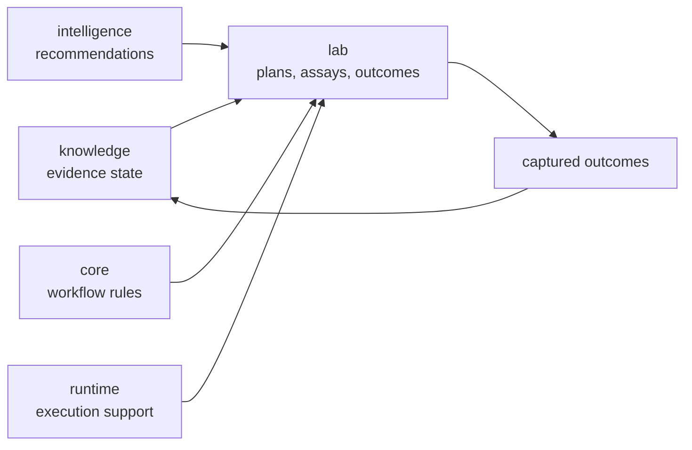

# bijux-proteomics-lab

`bijux-proteomics-lab` owns lab-facing execution in `bijux-proteomics`. It
turns plans and decisions into assay work, captures outcomes, and keeps
experiment-facing state separate from lower-layer contracts and runtime control.
This is where the repository stops being only a reasoning system and becomes a
practical instrument for experimental action.

## Why This Package Exists

- recommendation only matters if it can survive contact with real assays
- lab work needs its own language and artifacts instead of being reduced to
  runtime tasks
- outcomes must return to the evidence layer without losing experimental context

## What It Owns

- assay planning and experiment-facing workflows
- outcome capture, promotion, and closed-loop lab decisions
- lab-facing artifacts that connect recommendations to real execution

## Start With

- Open [Foundation](https://bijux.io/bijux-proteomics/07-bijux-proteomics-lab/foundation/)
  for the package role and boundary.
- Open [Interfaces](https://bijux.io/bijux-proteomics/07-bijux-proteomics-lab/interfaces/)
  when the question is a lab-facing contract or artifact surface.
- Open [bijux-proteomics-runtime](https://bijux.io/bijux-proteomics/09-bijux-proteomics-runtime/)
  when the issue becomes general execution control rather than lab ownership.

## What It Refuses

- evidence truth that belongs in knowledge
- recommendation policy that belongs in intelligence
- general execution orchestration that belongs in runtime

## First Proof Check

- `packages/bijux-proteomics-lab/src/bijux_proteomics_lab`
- `packages/bijux-proteomics-lab/tests`
- outcome and planning modules once a claim narrows to one surface
