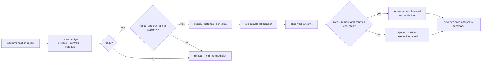
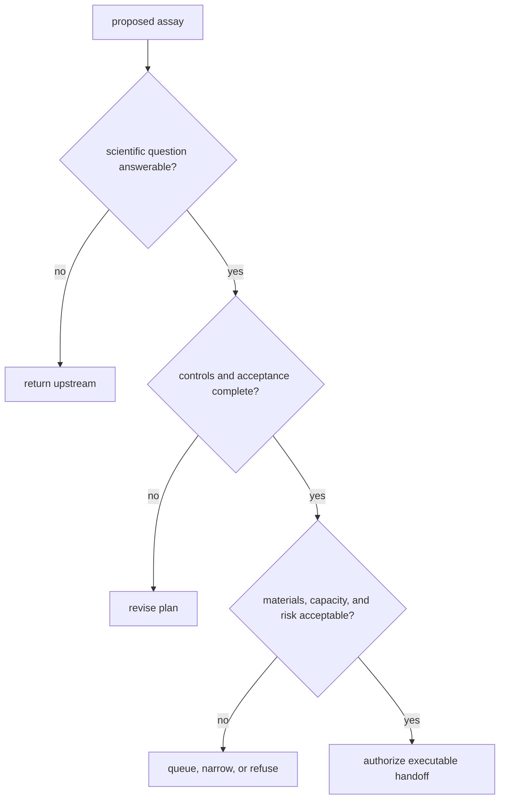
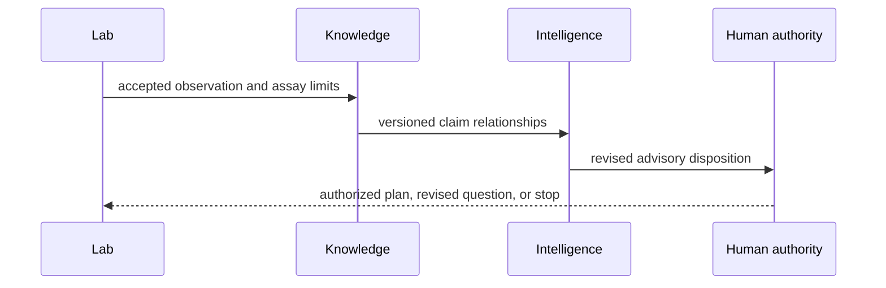
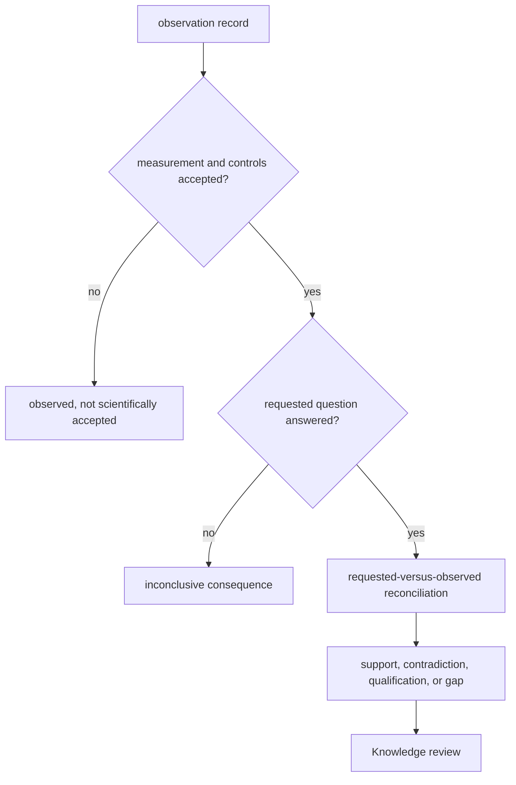
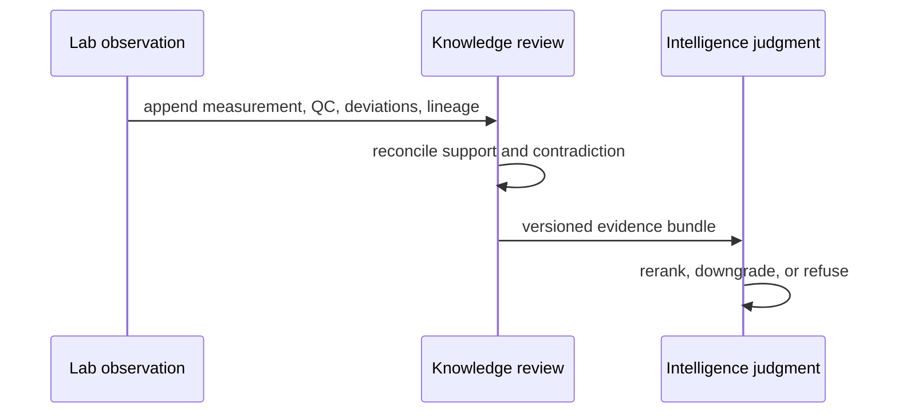
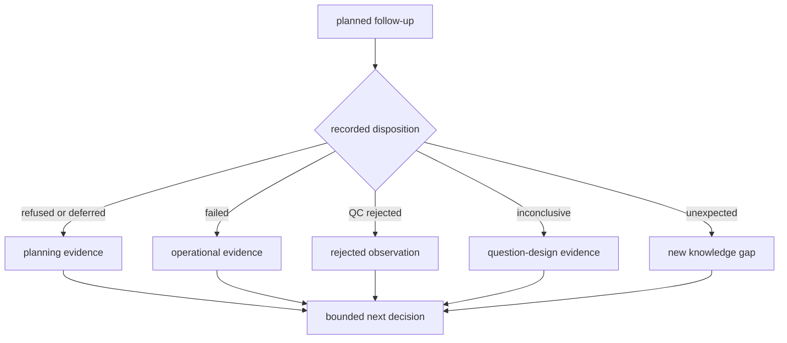

# bijux-proteomics-lab

`bijux-proteomics-lab` converts a supported recommendation into an operational
assay plan and records what the experiment actually observed. It owns assay
design, readiness, batching, scheduling, handoff, outcome capture, and feedback
to scientific review.

```bash
python -m pip install bijux-proteomics-lab
```

## Closed-loop validation



Planning and observation are separate records. A recommendation can be
scientifically plausible but operationally unready; an executed assay can be
technically successful but inconclusive; and an unexpected outcome can weaken
the upstream evidence or decision policy.

## Custody chain

An executable handoff crosses from analytical advice into material and
operational consequence. Custody therefore remains explicit at every stage:

| Stage | Accountable record | Required evidence before progression |
| --- | --- | --- |
| requested | recommendation and scientific question | target, rationale, uncertainty, requested measurement |
| designed | assay plan | protocol, controls, materials, acceptance criteria, known risks |
| ready | readiness decision | answerability, completeness, capacity, ownership, refusal checks |
| scheduled | batch and schedule | compatibility, priority, resources, timing, assigned operator |
| handed off | immutable handoff record | exact instructions, identities, custody acknowledgement |
| observed | observation record | raw and processed measurements, QC, deviations, failures |
| reconciled | consequence record | requested-versus-observed comparison and disposition |

A later record references its parents. It does not rewrite a recommendation,
plan, or observation to make the history appear more certain.

## Operational capabilities

| Surface | Responsibility |
| --- | --- |
| `design` | experiment and protocol contracts |
| `planning` | advisory and executable assay plans, priorities, queues, batches, schedules, and next-cycle planning |
| `readiness` | stage-specific operational checks and progression decisions |
| `lifecycle` | governed movement through lab states |
| `handoffs` | artifacts, explanations, serialization, PTM and QC feedback, risk, and transfer records |
| `outcomes` | observations and evidence feedback |
| `reconciliation` | requested-versus-observed follow-up and flagship closure |
| `benchmarks` | lab claims, rehearsals, follow-up evidence, learning, and outcome dossiers |

The package root exposes three planning entry points:

```python
from bijux_proteomics_lab import (
    build_advisory_assay_plan,
    build_executable_assay_plan,
    plan_experiment_batches,
)
```

An advisory plan can be produced while operational details remain incomplete.
An executable plan requires the stronger readiness and handoff information
needed to act. Batch planning groups ready work under declared constraints; it
does not make an unready assay executable.

## Plan and record types

| Artifact | Meaning | Authority |
| --- | --- | --- |
| advisory assay plan | scientifically relevant follow-up with unresolved operational detail | supports review and refinement only |
| executable assay plan | protocol, controls, materials, acceptance, and ownership satisfy readiness policy | eligible for scheduling and authorized handoff |
| batch plan | ready assays grouped under capacity and compatibility constraints | allocates work; does not change assay readiness |
| handoff record | exact instructions, identities, materials, risks, and acceptance criteria transferred to an operator | binds the planned work to execution custody |
| observation record | what was measured, including QC, deviations, missingness, and failures | records fact without interpreting upstream consequence |
| reconciliation record | requested-versus-observed comparison and disposition | feeds new evidence into scientific review |

## Readiness and refusal

Readiness evaluates scientific inputs, controls, materials, protocol detail,
capacity, scheduling constraints, and handoff completeness. A refusal is an
expected scientific safety result when a plan would waste material, obscure
interpretation, or create an outcome that cannot answer the stated question.

A refusal record identifies the blocking condition and a valid next action
such as narrowing the assay, adding controls, resolving an upstream
contradiction, rerunning analysis, or waiting for capacity. It is an
operational and scientific disposition, not a generic runtime failure.



Readiness is evaluated at the declared stage. Passing design review does not
imply material availability, scheduling approval, execution success, or an
interpretable outcome.

## Outcome feedback

Observed outcomes are reconciled against the requested measurements and
acceptance criteria. The resulting consequence record can:

- strengthen or weaken a knowledge claim;
- expose an unmodeled contradiction;
- recalibrate candidate ranking or recommendation confidence;
- trigger a revised assay plan;
- close a follow-up route as confirmed, rejected, or inconclusive.

History is append-only in meaning: later evidence can supersede a conclusion
without erasing the recommendation and assumptions that led to the experiment.

## Evidence promotion contract

An observation crosses three independent review boundaries before it can alter
an action. Lab records the measurement and its assay disposition; Knowledge
decides its relationship to a claim; Intelligence decides whether the revised
evidence changes the recommendation.

| Boundary | Record entering | Decision produced | Decision explicitly not produced |
| --- | --- | --- | --- |
| assay acceptance | raw and processed measurements, controls, QC, deviations | accepted, rejected, failed, or inconclusive observation | biological support or contradiction |
| claim reconciliation | accepted observation with subject, context, and lineage | support, contradiction, qualification, context, or gap | candidate rank or permission to act |
| decision revision | versioned evidence bundle and prior decision record | rerank, retain, downgrade, escalate, hold, or refuse | laboratory authorization |



Rejected and inconclusive observations remain durable records, but they do not
skip assay acceptance by being narratively useful. A new action always returns
through review and authorization.

## Interpret the outcome safely

Execution state, assay QC, answerability, and biological consequence are
separate judgments. The reconciliation record retains all four.

| Observed condition | Lab disposition | Downstream meaning |
| --- | --- | --- |
| work did not start because readiness failed | refused or deferred | no observation; return the blocking condition to the plan owner |
| execution failed before a valid measurement | operational failure | no scientific conclusion; preserve diagnostics and consumed resources |
| measurements exist but controls or QC fail | observed, not accepted | retain data and deviations; do not promote to claim evidence |
| QC passes but the requested contrast is unresolved | technically accepted, inconclusive | record answerability limits and revise the question or assay |
| accepted observation supports the expected direction | consequence supports the requested proposition | Knowledge determines the resulting support edge and its scope |
| accepted observation opposes the expected direction | consequence contradicts or qualifies the proposition | preserve the unexpected result and trigger review |
| accepted observation falls outside the planned interpretation | unmodeled consequence | create a knowledge gap; do not force it into confirm or reject |



The disposition must describe the observed record, not the hoped-for result.
Unexpected and inconclusive outcomes remain first-class evidence about the
assay, the question, or the upstream model.

## Observation is not interpretation

Lab owns what was requested, executed, measured, and observed under the assay
contract. Knowledge owns how the observation supports or contradicts a claim;
Intelligence owns whether the new evidence changes a ranking or action. This
separation prevents a technically clean measurement from being promoted
directly into biological certainty.



## Learn From Non-Confirming Work

A closed loop does not require a positive biological result. A readiness
refusal, execution failure, QC rejection, or inconclusive observation can still
protect material, expose a weak question, and produce evidence for the next
decision—provided its disposition is not collapsed into “no result.”

| Disposition | What was learned | Safe next route |
| --- | --- | --- |
| readiness refused | the plan cannot answer the question safely or completely under current conditions | add controls, resolve inputs, narrow scope, or stop |
| deferred | the plan may be valid but capacity, material, timing, or ownership is unavailable | retain priority and prerequisites without claiming execution |
| execution failed | the handoff began but did not yield an acceptable measurement | preserve diagnostics, consumed resources, and recovery boundary |
| observed, QC rejected | measurements exist but do not meet the assay contract | retain observations as rejected evidence and revise execution or controls |
| accepted, inconclusive | the assay worked but did not resolve the requested contrast | revise the question, power, measurement, or interpretation window |
| accepted, unexpected | the observation falls outside the anticipated support/refute frame | create a knowledge gap and review without forcing a binary label |



The [Workflow Refusal Handbook](foundation/workflow-refusal-handbook.md) maps
blocked work to safe responses, while
[Outcome Learning Loops](foundation/outcome-learning-loops.md) returns accepted
and non-confirming outcomes to evidence and policy review. Use
[Workflow Consequence Maps](../01-bijux-proteomics/foundation/workflow-consequence-maps.md)
to connect those outcomes to the workflow family’s next decision burden.

## Continue By Laboratory Question

| Need | Read next | Review is complete when |
| --- | --- | --- |
| evaluate cost, controls, and downstream burden | [lab consequence](foundation/lab-consequence.md) | feasibility, control burden, cost of error, and allowed action share one consequence record |
| return outcomes to evidence and policy | [outcome learning loops](foundation/outcome-learning-loops.md) | accepted, rejected, inconclusive, and unexpected outcomes reach their correct owner without rewriting history |
| map a refusal to a safe next action | [workflow refusal handbook](foundation/workflow-refusal-handbook.md) | the blocker, protected resource, responsible owner, and admissible next route are explicit |
| separate planning, readiness, handoff, and outcomes | [architecture](architecture/index.md) | every stage has its own identity, parent record, authority, and terminal disposition |
| choose Python or artifact contracts | [interfaces](interfaces/index.md) | the plan or outcome preserves controls, custody, deviations, QC, and refusal information |
| review operational and scientific bounds | [known limitations](quality/known-limitations.md) | technical completion is not presented as answerability, biological support, or authority to act |

Lab does not own upstream scientific computation, evidence truth,
recommendation policy, or general execution orchestration.
