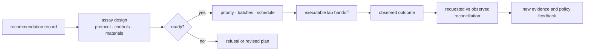
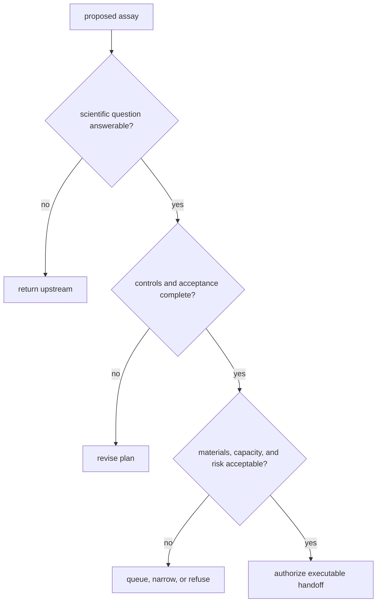
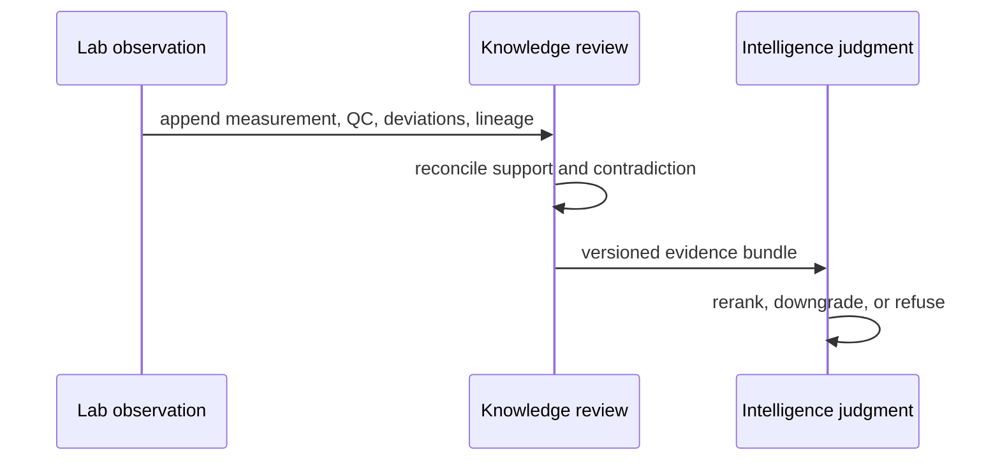

# bijux-proteomics-lab

`bijux-proteomics-lab` converts a supported recommendation into an operational
assay plan and records what the experiment actually observed. It owns assay
design, readiness, batching, scheduling, handoff, outcome capture, and feedback
to scientific review.

```bash
python -m pip install bijux-proteomics-lab
```

## Closed-loop validation



Planning and observation are separate records. A recommendation can be
scientifically plausible but operationally unready; an executed assay can be
technically successful but inconclusive; and an unexpected outcome can weaken
the upstream evidence or decision policy.

## Custody chain

An executable handoff crosses from analytical advice into material and
operational consequence. Custody therefore remains explicit at every stage:

| Stage | Accountable record | Required evidence before progression |
| --- | --- | --- |
| requested | recommendation and scientific question | target, rationale, uncertainty, requested measurement |
| designed | assay plan | protocol, controls, materials, acceptance criteria, known risks |
| ready | readiness decision | answerability, completeness, capacity, ownership, refusal checks |
| scheduled | batch and schedule | compatibility, priority, resources, timing, assigned operator |
| handed off | immutable handoff record | exact instructions, identities, custody acknowledgement |
| observed | observation record | raw and processed measurements, QC, deviations, failures |
| reconciled | consequence record | requested-versus-observed comparison and disposition |

A later record references its parents. It does not rewrite a recommendation,
plan, or observation to make the history appear more certain.

## Operational capabilities

| Surface | Responsibility |
| --- | --- |
| `design` | experiment and protocol contracts |
| `planning` | advisory and executable assay plans, priorities, queues, batches, schedules, and next-cycle planning |
| `readiness` | stage-specific operational checks and progression decisions |
| `lifecycle` | governed movement through lab states |
| `handoffs` | artifacts, explanations, serialization, PTM and QC feedback, risk, and transfer records |
| `outcomes` | observations and evidence feedback |
| `reconciliation` | requested-versus-observed follow-up and flagship closure |
| `benchmarks` | lab claims, rehearsals, follow-up evidence, learning, and outcome dossiers |

The package root exposes three planning entry points:

```python
from bijux_proteomics_lab import (
    build_advisory_assay_plan,
    build_executable_assay_plan,
    plan_experiment_batches,
)
```

An advisory plan can be produced while operational details remain incomplete.
An executable plan requires the stronger readiness and handoff information
needed to act. Batch planning groups ready work under declared constraints; it
does not make an unready assay executable.

## Plan and record types

| Artifact | Meaning | Authority |
| --- | --- | --- |
| advisory assay plan | scientifically relevant follow-up with unresolved operational detail | supports review and refinement only |
| executable assay plan | protocol, controls, materials, acceptance, and ownership satisfy readiness policy | eligible for scheduling and authorized handoff |
| batch plan | ready assays grouped under capacity and compatibility constraints | allocates work; does not change assay readiness |
| handoff record | exact instructions, identities, materials, risks, and acceptance criteria transferred to an operator | binds the planned work to execution custody |
| observation record | what was measured, including QC, deviations, missingness, and failures | records fact without interpreting upstream consequence |
| reconciliation record | requested-versus-observed comparison and disposition | feeds new evidence into scientific review |

## Readiness and refusal

Readiness evaluates scientific inputs, controls, materials, protocol detail,
capacity, scheduling constraints, and handoff completeness. A refusal is an
expected scientific safety result when a plan would waste material, obscure
interpretation, or create an outcome that cannot answer the stated question.

The refusal record should identify the blocking condition and a valid next
action such as narrowing the assay, adding controls, resolving an upstream
contradiction, rerunning analysis, or waiting for capacity. It must not be
rendered as a generic runtime failure.



Readiness is evaluated at the declared stage. Passing design review does not
imply material availability, scheduling approval, execution success, or an
interpretable outcome.

## Outcome feedback

Observed outcomes are reconciled against the requested measurements and
acceptance criteria. The resulting consequence record can:

- strengthen or weaken a knowledge claim;
- expose an unmodeled contradiction;
- recalibrate candidate ranking or recommendation confidence;
- trigger a revised assay plan;
- close a follow-up route as confirmed, rejected, or inconclusive.

History is append-only in meaning: later evidence can supersede a conclusion
without erasing the recommendation and assumptions that led to the experiment.

## Observation is not interpretation

Lab owns what was requested, executed, measured, and observed under the assay
contract. Knowledge owns how the observation supports or contradicts a claim;
Intelligence owns whether the new evidence changes a ranking or action. This
separation prevents a technically clean measurement from being promoted
directly into biological certainty.



## Documentation map

- [Lab consequence](foundation/lab-consequence.md) explains cost, controls, and
  downstream burden.
- [Outcome learning loops](foundation/outcome-learning-loops.md) covers feedback
  into evidence and policy.
- [Workflow refusal handbook](foundation/workflow-refusal-handbook.md) maps
  refusal reasons to safe next actions.
- [Architecture](architecture/index.md) separates planning, readiness, handoff,
  and outcomes.
- [Interfaces](interfaces/index.md) documents Python and artifact contracts.
- [Known limitations](quality/known-limitations.md) records operational and
  scientific bounds.

Lab does not own upstream scientific computation, evidence truth,
recommendation policy, or general execution orchestration.
