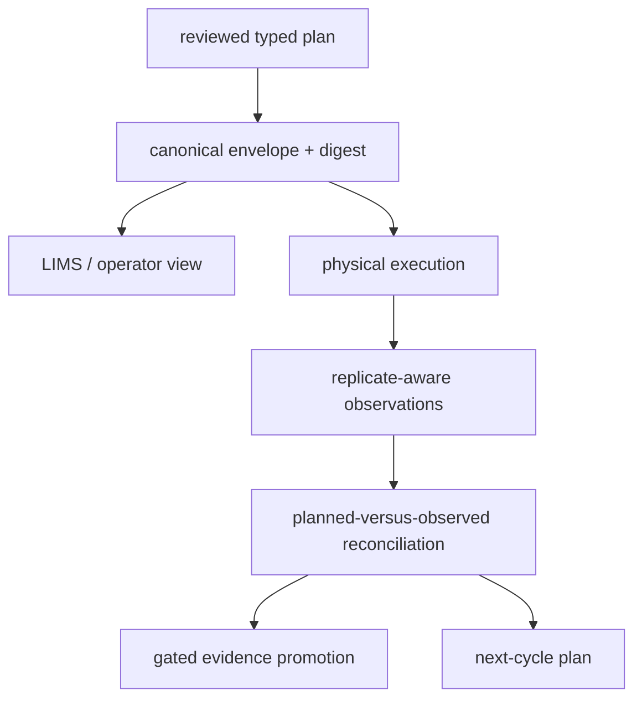

# Laboratory artifact contracts

Lab artifacts cross the highest-risk boundary in the repository: they turn a
scientific recommendation into physical work, then turn physical observations
back into evidence. Both directions require explicit authority and provenance.

## Handoff set

A responsible execution handoff contains:

- advisory plan and the evidence gaps that motivated it;
- reviewed experiment design, dependencies, and ordered batches;
- operational readiness and assay-risk assessments;
- executable instructions with sample requirements and preflight checks;
- protocol attachment with preparation, instrument method, controls, and known
  failure caveats;
- material reservations and capacity schedule;
- authority boundary naming which decisions belong to knowledge, intelligence,
  laboratory review, and execution operators;
- canonical envelope with schema, payload, and digest.

LIMS exports are operational views. The canonical plan and its envelope remain
the authoritative record when field mappings omit nested rationale or policy.

## Canonical envelope

`CanonicalArtifactEnvelope` wraps a typed payload and digest. Verification
detects content drift after handoff. Compatibility profiles and the artifact
contract registry determine whether a consumer can read the schema and produce
upgrade advisories when it cannot.

A valid digest proves payload identity under the envelope contract. It does not
prove that the printed protocol was followed or that a recorded observation is
scientifically correct.

## Outcome set

The return path should preserve:

- raw and summarized observations;
- assay and batch outcome states;
- QC feedback with stable reason codes;
- deviations from the plan and protocol;
- technical, biological, material, or interpretation failure classification;
- rerun policy and promotion blockers;
- normalized evidence input when promotion is allowed;
- feedback lineage into later prioritization and next-cycle work.

Outcome dossiers and follow-up learning artifacts connect benchmark claims to
operator runs, failure rehearsals, external review, and observed results.

## Immutability and authority

Never replace an advisory plan with an executable version at the same artifact
identity. Never replace an expected outcome with the observation. Emit linked
artifacts for each state change and record the actor or policy responsible.

Execution refusal is a successful safety artifact when controls, provenance,
evidence, materials, or review authority are insufficient. Suppressing it to
produce a superficially complete handoff destroys the laboratory trust boundary.

## Publication checklist

Verify schema compatibility, canonical digest, plan kind, batch identity,
instruction-to-assay mapping, dependency order, review gates, samples,
materials, controls, instrument and staffing readiness, refusal reasons,
observation QC, promotion decision, and feedback lineage before accepting a lab
artifact as complete.
