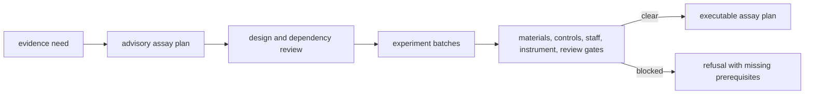

# Laboratory planning and outcome contracts

Lab translates scientific evidence needs into operationally reviewable work and
returns observed outcomes to the evidence system. Its central invariant is that
scientific advice is not an execution instruction.

## Advisory and executable plans

`AdvisoryAssayPlan` records open evidence gaps, assay recommendations, rationale,
and concrete wet-lab actions. It always carries `plan_kind="advisory"` and
`executable=false`.

`ExperimentPlan` groups governed assay requirements into ordered batches by
blocking status and assay family. It retains evidence gaps, blocking review
gates, sample requirements, and per-assay sample kinds. Dependencies constrain
order and cycles are rejected.

`ExecutableAssayPlan` selects one batch and emits instruction IDs, objectives,
sample kinds, blocking posture, and preflight checks. It is ready only when its
declared review gates and sample-kind blockers are clear.

Execution readiness describes the recorded plan and declared resources. It
does not predict assay success, sample integrity, instrument performance, or
data quality.

## Design and readiness

Design contracts make contrasts, biological and technical replication,
randomization, fractionation, multiplex channels, pooled references, spike-in
QC, and carryover risk explicit. Operational readiness combines material and
reagent inventory, staffing, instrument availability, controls, provenance,
evidence sufficiency, and review backlog pressure.

Missing prerequisites are outputs, not defaults. An irresponsible handoff is
represented by `LabExecutionRefusal` with stable reason codes and required
corrections.

## Observed outcomes

An assay observation preserves metric, value, unit, raw replicate values,
summary statistic, dispersion, QC state, normalization, censoring, and
interpretation confidence. An assay outcome distinguishes passed, biological
failure, technical failure, reproducibility failure, and inconclusive states,
with an explicit failure class and uncertainty.

Batch outcomes retain a rerun policy. Evidence promotion readiness checks the
observation and QC posture before converting a lab result into normalized
knowledge evidence.

## Reconciliation and feedback

Reconciliation compares planned and observed assay state, records deviations,
and produces operational follow-up plus intelligence feedback. Feedback can
change future priorities, but it must not rewrite the recommendation or plan
that preceded the experiment.

## Contract invariants

- Advisory plans cannot be mistaken for executable instructions.
- Every executable instruction belongs to one batch and names its prerequisites.
- Dependencies, blockers, and missing resources remain explicit.
- Observations preserve replicates, QC, normalization, censoring, and uncertainty.
- Technical, biological, reproducibility, and interpretation failures remain
  distinguishable.
- Evidence promotion is gated and provenance-preserving.
- New outcomes append to decision history rather than revising it silently.

These contracts put operational authority with laboratory reviewers while
keeping the evidence and decision lineage machine-readable.
