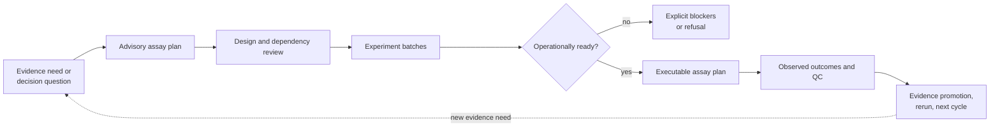

# Interfaces

Lab converts scientific intent into reviewable experimental design, planning,
readiness, handoff, outcome, and reconciliation contracts. The central
interface distinction is between advice and executable work: a scientifically
useful assay recommendation is not a laboratory instruction until dependencies,
review gates, samples, controls, capacity, provenance, and operational risks
have been made explicit.



## Interface bands

| Band | Public responsibility | Critical boundary |
| --- | --- | --- |
| `planning` | advisory plans, batches, dependencies, schedules, queues, capacity, materials | priority is not authorization |
| `design` | design validation, power advice, randomization, fractionation, multiplex labels, QC insertion, carryover | a valid layout does not guarantee adequate biological power |
| `readiness` | evidence, material, instrument, staffing, backlog, control, provenance, and budget checks | readiness is conditional on declared inputs |
| `handoffs` | explanation, authority, risk, artifact compatibility, LIMS export, PTM and targeted review, QC feedback | handoff must not hide unresolved risk or change scientific ownership |
| `outcomes` | assay observations, acceptance, failure classes, reliability, promotion, rerun, feedback | a completed run is not automatically promotable evidence |
| `lifecycle`, `reconciliation` | review transitions, candidate advancement, next-cycle and follow-up decisions | promotion remains governed and auditable |
| `benchmarks` | claim, follow-up, learning, rehearsal, and outcome-dossier evidence | rehearsal success is not production evidence |

## Public entry routes

The package root contains only the three primary planning operations:

```python
from bijux_proteomics_lab import (
    build_advisory_assay_plan,
    build_executable_assay_plan,
    plan_experiment_batches,
)
```

All richer contracts remain in their owner bands. Use
[Python API surface](api-surface.md) for the planning sequence and
[Public imports](public-imports.md) for choosing a root, band, or specialized
module import.

## Read by handoff

- [Data contracts](data-contracts.md) defines plans, instructions, readiness
  findings, observations, failures, and promotion states.
- [Artifact contracts](artifact-contracts.md) defines canonical envelopes,
  compatibility checks, LIMS exports, and outcome records.
- [Operator workflows](operator-workflows.md) follows work from advisory intent
  through outcome reconciliation.
- [Compatibility commitments](compatibility-commitments.md) covers schema,
  reason-code, readiness, and lifecycle stability.

## Safety and authority

Lab owns operational translation and evidence capture. Core owns scientific
analysis contracts, knowledge owns evidence memory, intelligence owns
recommendation and challenge, and human governance owns authorization. Lab can
refuse an irresponsible handoff, but it cannot manufacture evidence sufficiency
or silently clear a review gate.

Every executable plan therefore carries its blockers and preflight checks.
Every outcome retains QC, failure, reliability, and promotion context. Every
feedback path points back to the plan and decision question that caused the
work. These are interface requirements, not optional reporting detail.
