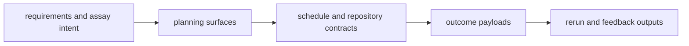

# Interfaces

`bijux-proteomics-lab` interfaces are where scientific intent turns into
operational work. This section should show how the package receives assay
requirements, publishes planning and schedule payloads, and emits outcome and
rerun signals that other packages can still reason about.

## What These Interfaces Need To Carry

- enough structure to make lab work executable, not merely discussable
- enough explicitness to connect outcomes back to plans and assay intent
- enough boundary clarity that lab payloads do not quietly absorb program
  authority or evidence semantics

## Start With

- open [Data Contracts](https://bijux.io/bijux-proteomics/07-bijux-proteomics-lab/interfaces/data-contracts/)
  when the question is what a plan, schedule, outcome, or rerun recommendation
  must contain
- open [Operator Workflows](https://bijux.io/bijux-proteomics/07-bijux-proteomics-lab/interfaces/operator-workflows/)
  when the reader wants the real lab-facing flow instead of a code view
- open [Artifact Contracts](https://bijux.io/bijux-proteomics/07-bijux-proteomics-lab/interfaces/artifact-contracts/)
  when the issue is persisted plans, execution records, or promoted outcomes
- open [Compatibility Commitments](https://bijux.io/bijux-proteomics/07-bijux-proteomics-lab/interfaces/compatibility-commitments/)
  before changing any published planning or outcome shape

## Read By Workflow Hand-Off

- [Public Imports](https://bijux.io/bijux-proteomics/07-bijux-proteomics-lab/interfaces/public-imports/)
  for code-level planning and outcome entrypoints
- [Data Contracts](https://bijux.io/bijux-proteomics/07-bijux-proteomics-lab/interfaces/data-contracts/)
  and [Artifact Contracts](https://bijux.io/bijux-proteomics/07-bijux-proteomics-lab/interfaces/artifact-contracts/)
  for the durable forms of lab work
- [API Surface](https://bijux.io/bijux-proteomics/07-bijux-proteomics-lab/interfaces/api-surface/),
  [CLI Surface](https://bijux.io/bijux-proteomics/07-bijux-proteomics-lab/interfaces/cli-surface/),
  and [Configuration Surface](https://bijux.io/bijux-proteomics/07-bijux-proteomics-lab/interfaces/configuration-surface/)
  for operator and automation entrypoints
- [Entrypoints and Examples](https://bijux.io/bijux-proteomics/07-bijux-proteomics-lab/interfaces/entrypoints-and-examples/)
  for concrete end-to-end planning examples

## What This Section Should Settle

- how assay intent becomes an executable artifact rather than a vague
  recommendation
- where outcome payloads belong in the wider proteomics story
- which lab-facing interfaces are stable enough for operators and repository
  tooling to depend on

## First Proof Check

- `src/bijux_proteomics_lab/planning/assays.py`, `planning/scheduling.py`, and `outcomes/observations.py`
- `src/bijux_proteomics_lab/design/protocols.py`, `handoffs/artifacts.py`, and `handoffs/serialization.py`
- `packages/bijux-proteomics-lab/tests`
