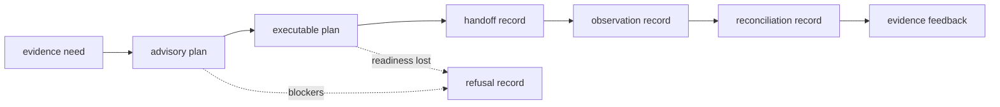
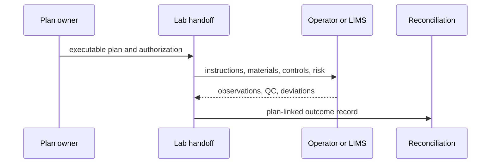

# Laboratory interfaces

Lab interfaces describe the artifacts that cross the boundary between
scientific intent and experimental consequence. They distinguish advice,
readiness, authorization, observation, and evidence promotion so no single
“success” field can collapse the laboratory lifecycle.



## Choose an interface

| Need | Owner | Output |
| --- | --- | --- |
| express scientifically useful follow-up | `planning.assays` | advisory assay plan |
| authorize an operationally complete plan | planning plus readiness | executable assay plan or refusal |
| group ready work | queue, priority, batching, scheduling | batch and schedule records with constraints |
| transfer work to an operator or system | `handoffs` | authority, risk, instruction, artifact, and export records |
| record what happened | `outcomes` | observation, QC, failure, reliability, and feedback |
| determine follow-up consequence | `reconciliation` | requested-versus-observed disposition and next action |
| test package claims | `benchmarks` | rehearsal, follow-up, learning, and outcome dossier |

The package root exposes three planning operations:

```python
from bijux_proteomics_lab import (
    build_advisory_assay_plan,
    build_executable_assay_plan,
    plan_experiment_batches,
)
```

[API surface](api-surface.md) defines their contracts. Use
[public imports](public-imports.md) for specialized owner modules.

## Executable-plan contract

An executable plan identifies:

- the upstream recommendation and evidence revision;
- biological question, measurable endpoint, and scientific rationale;
- assay, protocol, sample, material, and instrument requirements;
- positive, negative, process, and interpretation controls;
- randomization, blocking, fractionation, labels, and carryover handling where
  applicable;
- acceptance, failure, deviation, and stopping criteria;
- capacity, schedule, risk, ownership, and authorization;
- the observation and reconciliation artifacts expected after execution.

Missing required information produces a readiness finding or refusal rather
than a partially executable instruction. [Data contracts](data-contracts.md)
defines fields, reason codes, and lifecycle states.

## Handoff contract



Handoff serialization preserves identifiers and compatibility while adapting
to external systems. An export is not proof that a LIMS accepted or executed
the work. [Artifact contracts](artifact-contracts.md) defines envelopes,
exports, and round-trip expectations.

## Outcome and promotion

An observation record reports measured facts. Promotion is a separate governed
decision based on QC, reliability, deviations, acceptance criteria, and the
original question. An outcome may be accepted operationally but remain
inconclusive scientifically.

[Operator workflows](operator-workflows.md) follows the full handoff and
feedback loop. [Compatibility commitments](compatibility-commitments.md)
covers plan, readiness, reason-code, lifecycle, and artifact evolution.

## Safety and authority

Lab may refuse unsafe, wasteful, under-controlled, or uninterpretable work. It
does not manufacture upstream evidence sufficiency, replace Intelligence
ranking, or grant itself human authorization. [Configuration surface](configuration-surface.md)
separates declared readiness and planning policy from hidden operator defaults.
