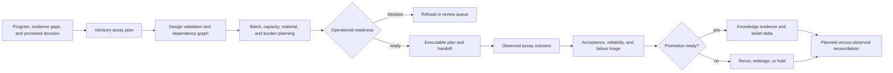

# Laboratory follow-up workflow

The lab workflow converts an evidence gap into controlled work and returns the
observed result to the decision system. Each transition produces a distinct
artifact so scientific advice cannot quietly become execution authority and a
completed assay cannot automatically become decision-grade evidence.

## Plan work that can answer the question

1. Start from a governed program, evidence bundle, and explicit decision or
   evidence gap. Build an advisory plan and retain the rationale for every
   recommended assay.
2. Validate contrasts, controls, replication, blocking, pairing, sample
   identity, and expected power. Add randomization, fractionation, multiplex,
   QC, plate, carryover, and protocol details where the assay requires them.
3. Build assay dependencies and reject unknown, self-referential, or cyclic
   edges. Separate gate assays from supporting assays.
4. Rank information gain against cost, material, capacity, turnaround, and
   operational burden. Deferred assays remain visible in the schedule report.

## Authorize an executable handoff

1. Select one batch and declare available sample kinds and operational
   resources. Run the readiness surfaces; do not treat inventory as review
   clearance.
2. Confirm required controls, sample lineage, protocol attachments, failure
   caveats, instrument method, and preflight checks.
3. Build the executable plan, risk assessment, and canonical artifact
   envelope. Verify the envelope immediately before export.
4. If a target LIMS cannot represent a field, publish the mapping and loss
   report with the export. Never hide flattened notes, omitted constraints, or
   changed identifiers.
5. Refuse the handoff when evidence, controls, authority, or feasibility is
   insufficient. Refusal is an operational safety result.

## Capture and return the outcome

1. Record assay result state, QC state, replicate values, dispersion,
   normalization, censoring, interpretation confidence, protocol deviations,
   and failure class.
2. Evaluate the declared acceptance rule and distinguish technical,
   reproducibility, biological, and inconclusive outcomes.
3. Build batch failure triage, reliability assessment, readiness matrix, and
   rerun plan before evidence promotion.
4. Promote only eligible outcomes under a named policy. Preserve blocked
   outcomes and the reason they were excluded.
5. Reconcile requested versus observed value and send evidence records, claim
   belief deltas, missing requested assays, and operational lessons back to
   knowledge and intelligence without rewriting the original plan.
