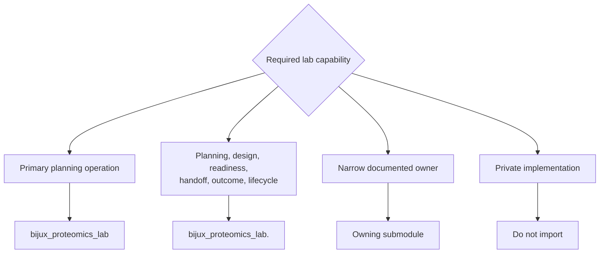

# Public imports

Lab keeps its package root deliberately small. Import the three primary
planning operations from the root, use a band facade for cohesive workflow
capabilities, and use a specialized module only when it is the documented
contract owner.



## Root imports

```python
from bijux_proteomics_lab import plan_experiment_batches
```

Use the root only for `plan_experiment_batches`,
`build_advisory_assay_plan`, and `build_executable_assay_plan`. Adding outcome,
readiness, or handoff symbols to this facade would blur the planning boundary.

## Band imports

```python
from bijux_proteomics_lab.design import validate_experiment_design
from bijux_proteomics_lab.outcomes import assess_batch_outcome
from bijux_proteomics_lab.readiness import build_operational_readiness_report
```

Band facades are the normal route for related lab capabilities. The `handoffs`
facade is curated and lazy-loads its explicit risk, explanation, refusal,
serialization, artifact, export, PTM, targeted-transition, and QC-feedback
contracts. Planning, design, and outcomes expose their owned module families.

## Specialized imports

```python
from bijux_proteomics_lab.handoffs.explanations import (
    build_handoff_explanation,
    refuse_irresponsible_assay_handoff,
)
from bijux_proteomics_lab.lifecycle.progression import (
    advance_assay_lifecycle,
)
```

Use the specialized path when it communicates a durable subdomain more clearly
than a broad band import. Do not reach through one band to access a contract
owned by another.

## Ownership rules

- Program definitions and assay requirements come from core.
- Evidence bundles and promoted evidence records come from knowledge.
- Candidate recommendations and decision support come from intelligence.
- Lab owns the operational translation, readiness finding, execution handoff,
  observed outcome, and feedback record.
- Runtime may execute or transport lab work but does not redefine these
  contracts.

Avoid underscore-prefixed helpers, source-tree-only paths, and command or test
modules as production interfaces. Import success alone is not a compatibility
guarantee: readiness thresholds, blocker reason codes, lifecycle transitions,
acceptance rules, failure classes, artifact profiles, and promotion criteria
also carry stable meaning. Review them with [Data contracts](data-contracts.md)
and [Compatibility commitments](compatibility-commitments.md).
