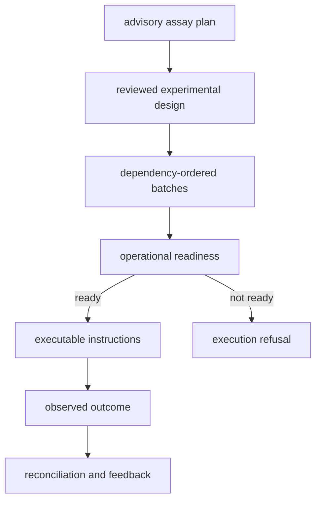

# Laboratory workflows

Laboratory work crosses from scientific advice into physical execution. The
workflow therefore requires an explicit promotion from advisory planning to a
reviewed executable plan, followed by a separate observed-outcome record.

## Plan follow-up

Begin with a governed program and evidence bundle. Build an advisory assay plan
that maps open evidence needs to assay recommendations and wet-lab actions.
Review the objective, blocking posture, rationale, sample kind, and unresolved
evidence for every recommendation.

An advisory plan is never an operator instruction. It carries
`plan_kind="advisory"` and `executable=false` so that serialization cannot erase
the boundary.

## Design and batch work

Translate accepted advice into an experimental design with explicit contrasts,
biological and technical replication, randomization, blocking, fractionation,
multiplex roles, controls, and carryover risk.

`plan_experiment_batches()` groups assays by blocking status and assay family,
orders declared dependencies, attaches review gates, and records sample
requirements. Reject dependency cycles and missing prerequisites before
scheduling.

## Establish readiness

Assess materials, reagents, controls, provenance, evidence sufficiency,
staffing, instrument availability, review backlog, and assay-specific risk.
Capacity and scheduling reports should expose delayed or infeasible batches
rather than silently reordering scientific priority.

When prerequisites are insufficient, emit a `LabExecutionRefusal` with stable
reason codes and required corrections. A refusal is the correct outcome when
execution would be irresponsible.

## Create the handoff

Select one reviewed batch and build executable instructions. Each instruction
names its assay, batch, sample kind, objective, blocking posture, and preflight
checks. Attach protocol version, preparation metadata, instrument method,
controls, failure caveats, material reservations, and the authority boundary.

Wrap the typed payload in a canonical artifact envelope and verify its digest
before export. A LIMS payload is an operational view; preserve the canonical
plan when field mapping loses nested rationale or policy.

## Capture outcomes

Record raw replicate values, summary statistic, dispersion, unit, QC state,
normalization, censoring, detection limit, batch-effect notes, and interpretation
confidence. Classify failed outcomes as technical, biological, reproducibility,
material, or interpretation failures rather than reducing every result to
pass/fail.

Apply the declared rerun policy and evaluate evidence-promotion readiness. A
result blocked by QC remains an outcome but does not become trusted knowledge
evidence.

## Reconcile and continue

Compare requested and observed assays, plan deviations, expected and observed
states, resource use, and unresolved evidence. Emit a reconciliation report,
operator follow-through actions, intelligence feedback, and a next-cycle plan
when justified.

Do not replace the original recommendation, plan, or expected outcome. Link new
records to them so later reviewers can determine what was known and authorized
at each boundary.

See [laboratory planning and outcome contracts](../interfaces/data-contracts.md)
and [laboratory artifact contracts](../interfaces/artifact-contracts.md).
