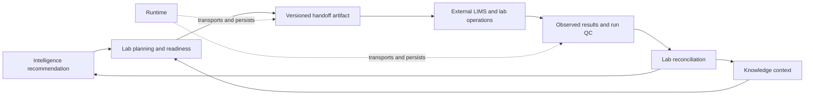

# Deployment Boundaries

Lab owns the semantic boundary between a recommended follow-up and responsible external execution. It does not control instruments, mutate a LIMS, reserve physical inventory, or operate a scheduling service by itself.

## Deployment components

| Component | Owner |
| --- | --- |
| assay design, dependency validation, priority, readiness, and lifecycle decisions | Lab |
| handoff explanation, refusal, risk, canonical envelope, and LIMS field mapping | Lab |
| HTTP routes, queues, retries, persistence, credentials, and delivery monitoring | Runtime or host application |
| inventory reservation, instrument booking, method upload, and physical execution | external laboratory systems and authorized operators |
| measured scientific semantics | Core |
| curated context and source provenance | Knowledge |
| recommendation policy | Intelligence |

## Handoff transaction

Treat delivery as an acknowledged artifact exchange:

1. freeze the executable plan, protocol attachment, controls, risks, and caveats;
2. build a canonical envelope and fingerprint the payload;
3. map fields to the destination schema and report every omission or transformation;
4. require destination acknowledgement tied to the artifact identity;
5. reject or quarantine a handoff when required information cannot be represented;
6. ingest run QC and observations as new artifacts, never as mutation of the original plan.

Retries must be idempotent at the destination. A network timeout after submission cannot justify creating a duplicate assay batch. Runtime owns retry mechanics; the integration contract must expose a stable handoff identity that makes safe retry possible.

## Authority and refusal

`refuse_irresponsible_assay_handoff` records when evidence, controls, provenance, readiness, or package authority is insufficient. A host must preserve that refusal rather than converting it into a warning and submitting the work anyway.

An executable plan is still not an instrument command. Authorized operators and validated laboratory systems remain responsible for local safety, regulatory requirements, method approval, and physical execution.

## Outcome ingestion

Accept observations only when they link to the delivered plan and carry protocol context, run QC, failure state, and artifact provenance. Late, partial, or duplicate results remain explicit. Reconciliation may recommend rerun, escalation, evidence promotion, or policy review; it must not rewrite the historical request to match what happened.
