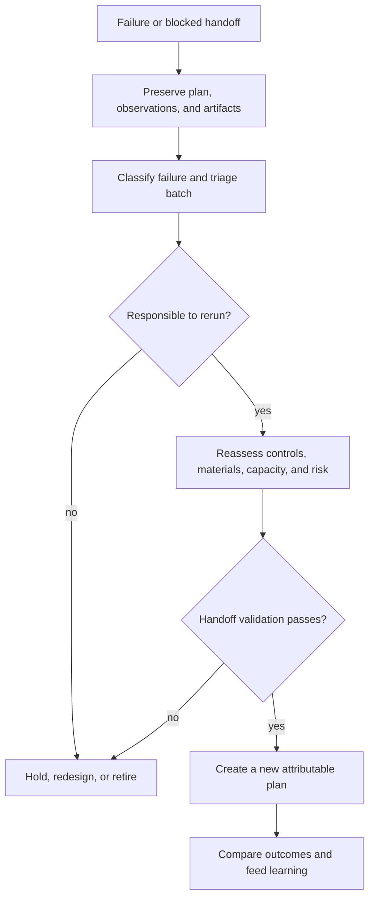

# Failure Recovery

Lab recovery begins with the actual observation, not the planned outcome. A
failed assay, blocked batch, incomplete handoff, or lossy LIMS export must remain
visible in durable history while the next action is assessed from scientific
and operational evidence.

## Preserve the incident record

Retain the experiment plan, batch and assay identifiers, upstream recommendation
and evidence references, schedule, material reservations, required controls,
risk assessment, handoff validation, LIMS export and loss notes, observations,
and outcome assessment. Record what was actually executed and observed. Do not
edit the original plan to resemble the recovered attempt.

Classify failures by their owning boundary:

| Condition | Response |
| --- | --- |
| Upstream recommendation is ambiguous, stale, or on hold | Reopen review; do not schedule from inference. |
| Required control, sample, reagent, staff, instrument, or capacity is unavailable | Keep the batch blocked and rebuild practicality and schedule reports. |
| Assay feasibility or predicted failure risk is unacceptable | Redesign or refuse the handoff. |
| Observation is missing or inconsistent with the planned assay | Reconcile identifiers and custody before scientific interpretation. |
| Execution completed but QC or outcome assessment failed | Triage the failure class and decide rerun, redesign, or retirement. |
| LIMS mapping loses required meaning | Correct the mapping and issue a new export bundle with loss reporting. |

## Authorize a new attempt

A rerun is a new attributable plan. Reassess decision readiness, assay risk,
controls, material feasibility, instrument and staff capacity, schedule
pressure, and blocking review gates. Preserve changes to protocol, batch design,
controls, or acceptance criteria as explicit differences. A failed assay should
feed future priority and planning models rather than disappear behind a
successful batch summary.

Recovery is complete when the new handoff passes validation, its LIMS export is
reviewable, observations reconcile to planned assays, the outcome assessment is
recorded, and the learning record explains what changed. A scheduled slot or a
successful serialization alone does not demonstrate a responsible recovery.
