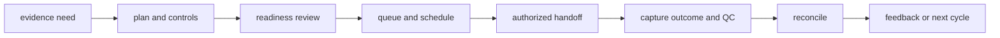
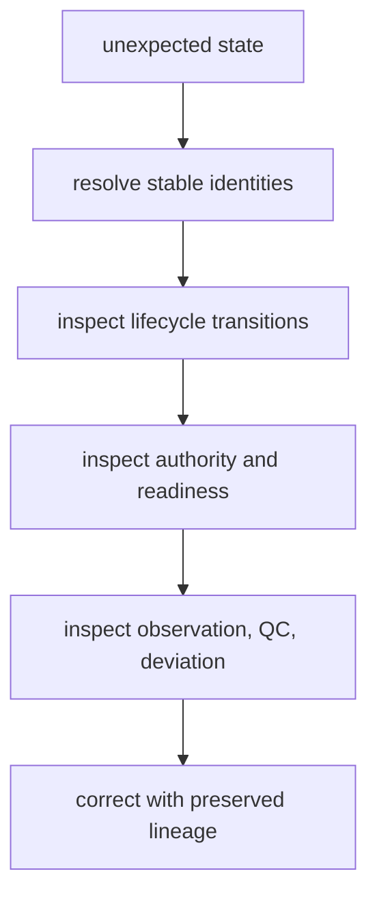

# Operating the laboratory loop

Lab operations maintain traceability from evidence need through planning,
readiness, handoff, observation, reconciliation, and feedback. Operational
pressure—capacity, materials, schedules, safety, and instrument constraints—is
part of the contract, not an inconvenience to omit from the record.

## Standard operating sequence

1. Resolve the upstream recommendation and evidence identities.
2. Define the question, endpoint, assay, protocol, controls, and acceptance
   criteria.
3. Evaluate sample, material, instrument, staffing, safety, provenance, budget,
   and handoff readiness.
4. Refuse, narrow, revise, or queue work that is not executable.
5. Group only ready assays into compatible batches and schedules.
6. Transfer authorized instructions with custody, risk, and expected outputs.
7. Capture observations, QC, deviations, missingness, and failures.
8. Reconcile the outcome and append feedback to Knowledge and future policy.

[Common workflows](common-workflows.md) expands these routes;
[installation and setup](installation-and-setup.md) covers package-local use.

## Operational triage

| Condition | Disposition | Evidence retained |
| --- | --- | --- |
| question or endpoint cannot be measured | return upstream or refuse | missing premise and requested clarification |
| controls or acceptance are incomplete | revise design | readiness findings and required controls |
| material or capacity unavailable | queue, reschedule, narrow, or refuse | resource constraint and priority policy |
| handoff loses authority or provenance | block transfer | plan, ownership, and compatibility findings |
| assay completed with failed QC | record failure; do not promote | raw observation, QC, deviations, failure class |
| valid measurement is scientifically inconclusive | reconcile as inconclusive | accepted observation and unresolved question |
| observation contradicts expectation | append evidence and reopen review | outcome lineage and contradiction context |

## Queue and schedule discipline

Priority does not override readiness. Batch compatibility considers assay,
sample, label, instrument, control, carryover, material, and timing constraints.
A scheduler may delay ready work; it may not convert unready work into an
executable plan.

Scaling routes must preserve stable ordering and policy under identical inputs.
[Performance and scaling](performance-and-scaling.md) defines comparison and
capacity expectations.

## Diagnose the loop

Use [observability and diagnostics](observability-and-diagnostics.md) to trace a
plan through readiness, queue, handoff, and outcome artifacts. When a record is
incorrect, [failure recovery](failure-recovery.md) creates a corrected or
superseding record without erasing the original custody trail.

## Security and external systems

Lab artifacts may expose sample metadata, unpublished targets, protocols,
facility capacity, and operational risk. Apply least-privilege access, redact
only through declared export policy, and never place credentials in plan or
handoff records. See [security and safety](security-and-safety.md) and
[deployment boundaries](deployment-boundaries.md).

## Release boundary

Changes to readiness, batching, scheduling, authority, refusal, outcome,
reliability, or promotion semantics can alter real-world consequence.
[Release and versioning](release-and-versioning.md) requires negative paths,
before-and-after artifacts, compatibility review, and explicit remaining
limitations.
