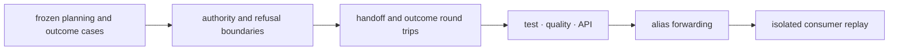

# Release and versioning

Lab participates in the repository's Git-tag-derived version line through
`hatch-vcs`. Release review is operational: it must show that an upgraded
consumer cannot silently change authorization, readiness, instructions,
observations, or follow-up obligations.

## Classify operational impact

| Change | Release evidence |
| --- | --- |
| planning implementation | identical advisory/executable state and rationale for frozen cases |
| readiness or refusal policy | boundary cases and changed remediation |
| handoff schema | old payload load or migration plus operator-view comparison |
| scheduling logic | dependency, capacity, ordering, and infeasibility comparison |
| outcome semantics | units, QC, censoring, failure class, and promotion behavior |
| public export | canonical and `proteomics-lab` forwarding proof |

Computational package versions do not validate physical protocols or
instruments. A release can prove deterministic planning and artifact behavior;
claims about laboratory performance require separately governed observed data.

## Release evidence chain



Run the package gates from the repository root:

```bash
make test PACKAGE=bijux-proteomics-lab
make quality PACKAGE=bijux-proteomics-lab
make api PACKAGE=bijux-proteomics-lab
make build PACKAGE=bijux-proteomics-lab
make test PACKAGE=proteomics-lab
```

For handoff changes, compare the canonical artifact, its digest, the exported
operator or LIMS view, and acknowledgement behavior. For outcome changes, replay
successful, failed-QC, censored, deviated, and rerun-required cases.

## Changelog and rollout

Update `packages/bijux-proteomics-lab/CHANGELOG.md` with the affected
operational state, payload or policy change, compatibility route, operator
impact, and any required regeneration of planned work. Never imply that a
software release retrospectively changes an already authorized instruction or
recorded observation.

Coordinate with Intelligence when recommendations feeding assay plans change,
with Knowledge when outcomes can become evidence, and with Core when units or
scientific result contracts move. Lab retains authority over execution posture
and refusal.

After publication, install the exact wheel in an empty environment and replay
one advisory-to-refusal case plus one authorized-handoff-to-outcome case. Verify
`proteomics-lab` when root exports move. Successful upload establishes package
delivery; the replays establish that operational boundaries survived release.
