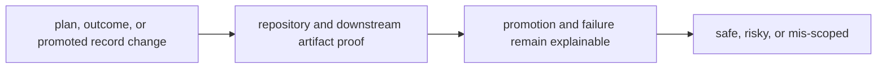

# Change Validation

Change validation should make it obvious whether a package edit is safe, risky, or mis-scoped.

## Validation Model

This page should make lab validation about durable state transitions. A change
is safe only when planning, promotion, and failure behavior remain explicit
enough for downstream readers and repositories to verify.

## Review Rules

- require proof when a plan, outcome, or promoted record changes meaning
- run repository and downstream artifact checks with payload edits
- reject changes that hide why a promotion or failure occurred

## First Proof Check

- `packages/bijux-proteomics-lab/tests`
- `src/bijux_proteomics_lab/planning.py` and `outcomes.py`
- `src/bijux_proteomics_lab/repositories.py` and `serialization.py`

## Design Pressure

Lab validation weakens when promoted state can change faster than the system
can explain why it changed. Proof has to stay close to planning, outcomes, and
artifact movement together.
