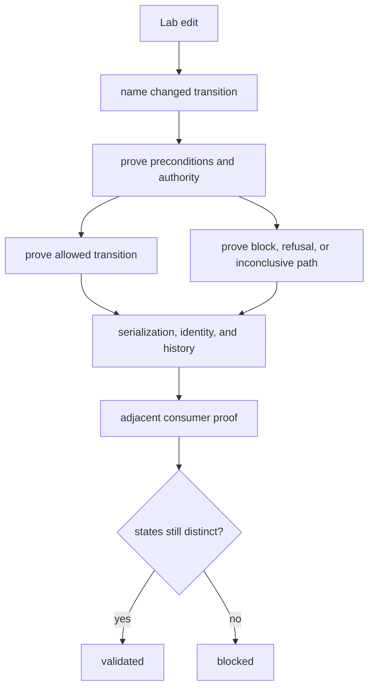

# Change validation

Validate Lab changes across the complete affected transition: input state,
preconditions, authority, output state, refusal, serialization, history, and
downstream interpretation.

## Change-to-proof map

| Change | Required proof | Adjacent owner review |
| --- | --- | --- |
| assay or experiment design | answerable and unanswerable question, controls, replication, blocking, dependencies, acceptance | Core scientific contract and Intelligence evidence need |
| readiness rule | ready, conditional, blocked, refused, missing evidence, safe next action | operator authority and site inputs |
| queue or scheduling | ready-only admission, capacity, priority, stable ordering, incompatibility, deferral | operational policy and custody |
| executable plan or handoff | frozen intent, authority, provenance, risk, target validation, mapping loss, rejection | external system contract and Runtime artifact envelope |
| observation model | plan linkage, partial and missing values, deviations, failure classes, round trip | Foundation serialization and Core meaning |
| QC or reliability | acceptance boundaries, controls, dispersion, reproducibility, failure and inconclusive | scientific owner and operator review |
| reconciliation or promotion | requested/observed delta, rerun, redesign, hold, eligibility, append-only history | Knowledge evidence and Intelligence policy |
| feedback payload | original decision reference, outcome lineage, version, non-mutation | Knowledge and Intelligence consumers |

## Validation route

Compare plan, handoff, observation, QC, and promotion records separately. Check
that identifiers join them without one record overwriting another. Re-run the
relevant downstream test when a payload or disposition crosses package
ownership.

## Validation record

State the transition, preconditions, authority, valid result, blocked or
refused result, identifiers, serialization, retained history, downstream
consumer, exact checks, and physical-execution evidence if any. Never use a
handoff test as evidence that laboratory work occurred.
