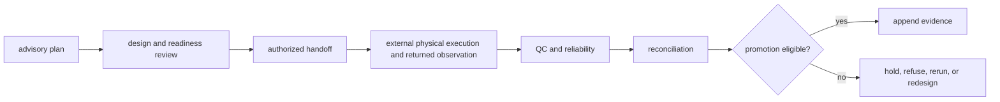

# Definition of done

A Lab change is complete when an operator can reconstruct planned intent,
readiness, authority, handoff, observation, QC, reconciliation, and promotion
without treating any one state as proof of the next.

## Completion by laboratory contract

| Changed surface | Required evidence | Required non-success case |
| --- | --- | --- |
| assay or experiment design | endpoint, contrasts, controls, replication, blocking, power advice, and acceptance rule | design cannot answer the question |
| dependency or batch plan | valid acyclic dependencies, gates, sample identity, and stable ordering | missing, cyclic, incompatible, or deferred work |
| readiness | material, instrument, capacity, staffing, cost, risk, authority, and provenance | blocked, conditional, and refused readiness |
| schedule or queue | ready-only admission, capacity, compatibility, priority policy, and reproducibility | priority cannot bypass a gate |
| executable handoff | approved intent, custody, instructions, controls, risks, identity, and target validation | export loss, rejected target, or missing authorization |
| observation | plan linkage, replicate values, missingness, deviations, failure class, and immutable raw record | partial, failed, or inconclusive outcome |
| QC and reliability | declared acceptance, controls, dispersion, reproducibility, and reason codes | completed work fails acceptance |
| reconciliation or promotion | requested-versus-observed comparison, eligibility policy, rerun or hold, and append-only feedback | evidence is not promoted |

## Laboratory evidence loop

Use the focused design, planning, readiness, handoff, outcome, and
reconciliation suites. When a payload crosses packages, also run the Core,
Foundation, Knowledge, Intelligence, or Runtime compatibility test that owns
the adjacent meaning.

## Completion record

Retain plan and batch identity, evidence need, controls, readiness inputs,
authority, custody, handoff hash, returned observations, deviations, QC,
failure or inconclusive class, promotion policy, and follow-up. Record physical
execution as external to this Python package.

## Not complete

Work remains incomplete when `ready` is inferred from inventory alone,
priority bypasses controls, a successful export is called execution, a
completed assay is called accepted without QC, or promotion overwrites the
original observation or plan.
