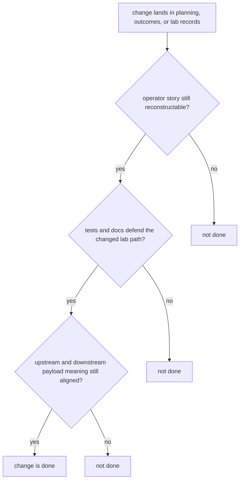

# Definition of Done

Done means the package is easier to trust after the change, not just that the diff merged.

For `bijux-proteomics-lab`, done means an operator can still reconstruct what was planned, what happened, and what was promoted from the durable record.

## Completion Model

The real threshold is not just correctness at runtime. It is whether the promoted lab record still tells a coherent story to the next operator and the next system boundary.

## Review Rules

- operators can still explain what happened from the durable record
- tests and docs defend the changed lab surface clearly
- upstream and downstream consumers still align on the payload meaning

## First Proof Check

- `packages/bijux-proteomics-lab/tests`
- `src/bijux_proteomics_lab/planning/assays.py`, `planning/scheduling.py`, and `outcomes/observations.py`
- `src/bijux_proteomics_lab/reconciliation/follow_up.py` and `serialization.py`

## Design Pressure

The easy mistake is to treat successful execution as enough while letting planning intent, outcome meaning, or promotion history become harder to audit.
