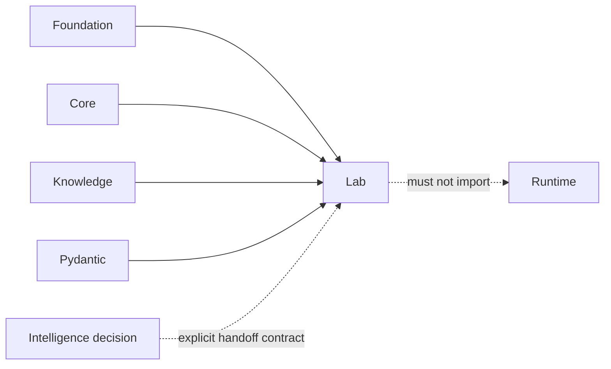

# Dependency Governance

Lab depends on Foundation, Core, Knowledge, and Pydantic. The graph supports
durable consequence records without importing Runtime orchestration or
Intelligence recommendation policy into laboratory ownership.

## Current Dependency Contract

| Dependency | Permitted role | Authority that remains external |
| --- | --- | --- |
| `bijux-proteomics-foundation` | identifiers, provenance, shared lifecycle contracts | canonical primitive meaning |
| `bijux-proteomics-core` | scientific result and assay-relevant data contracts | scientific computation and inference |
| `bijux-proteomics-knowledge` | evidence, biological grounding, promoted-record handoff | evidence custody and claim truth |
| Pydantic | validation and serialization of plans, handoffs, and outcomes | lifecycle validity and scientific acceptance |

Intelligence is not an installed dependency. Recommendation inputs must cross a
reviewable handoff boundary so Lab can assess feasibility without inheriting or
reimplementing ranking policy. Runtime is also absent: Lab describes executable
work and records consequence, while Runtime owns execution mechanics.

## Admission Test

A dependency is acceptable only when:

1. It supports assay design, readiness, scheduling, handoff, observation, or
   outcome reconciliation.
2. Lifecycle transitions remain explicit in Lab code.
3. Shared and scientific meanings remain with their upstream owner.
4. Failure, absence, and degraded operation are recordable without fabrication.
5. Operator-visible artifacts remain serializable and reviewable.
6. It does not start work, mutate Knowledge custody, or apply recommendation
   policy as an import side effect.

Hardware SDKs, schedulers, inventory services, and laboratory information
systems belong behind adapters. Their availability and identifiers may affect
readiness, but their object models must not define the durable Lab contract.

## Rejection Signals

Reject a dependency that hides mutable global capacity, converts a technical
failure into a biological result, requires network access to read a retained
record, bypasses transition validation, or makes generated convenience objects
the owner of protocol and outcome meaning.
