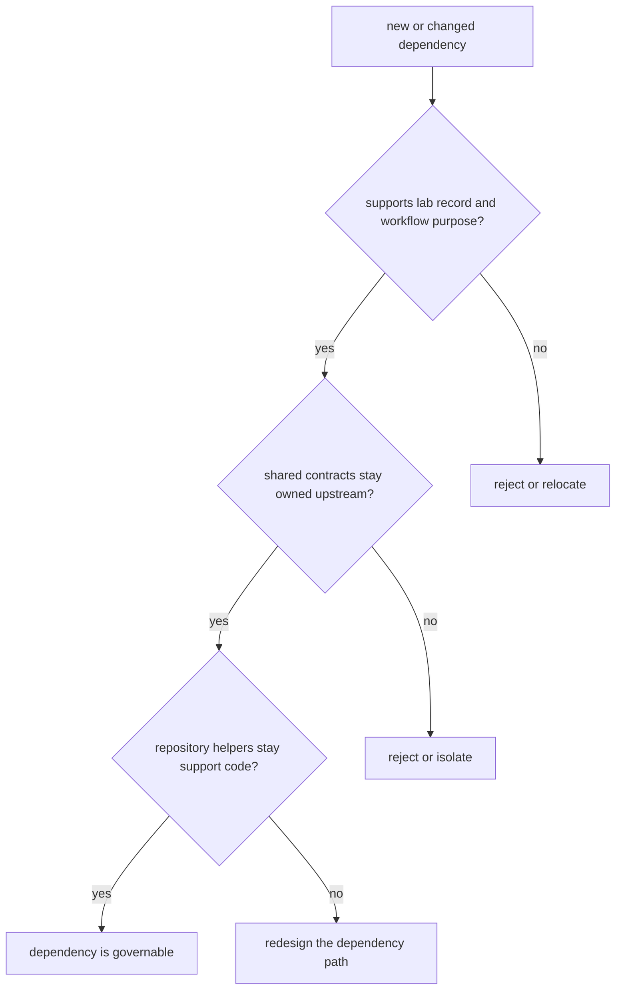

# Dependency Governance

Dependency governance is really boundary governance under another name.

For `bijux-proteomics-lab`, dependency review should preserve the line between durable lab records, upstream recommendation logic, and repository helpers that support but do not own behavior.

## Governance Model

This page should help reviewers keep the lab package honest. A dependency is risky when it makes local convenience the hidden owner of contract meaning or workflow decisions.

## Review Rules

- guard the line between lab records and upstream recommendation logic
- keep shared contracts in foundation and core rather than copying them locally
- avoid dependencies that make repository helpers the hidden owner of behavior

## First Proof Check

- `packages/bijux-proteomics-lab/tests`
- `src/bijux_proteomics_lab/planning/assays.py`, `planning/scheduling.py`, and `outcomes/observations.py`
- `src/bijux_proteomics_lab/reconciliation/follow_up.py` and `serialization.py`

## Design Pressure

The easy drift is to pull shared contract meaning or workflow policy into the lab package because a helper dependency makes that move feel cheap.
