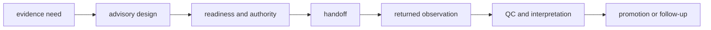

# Documentation standards

Laboratory language must preserve state and authority. “Planned,” “ready,”
“authorized,” “handed off,” “observed,” “accepted,” and “promoted” describe
different records; substituting one for another can turn advice into an unsafe
instruction or a weak observation into overstated evidence.

## Operational vocabulary

| Term | Required context | Must not imply |
| --- | --- | --- |
| **advisory plan** | evidence need, assay rationale, controls, dependencies, and `executable = false` | authorization or operational readiness |
| **ready** | named batch, current resources, controls, lineage, capacity, risk, and authority gates | scientific value or successful execution |
| **authorized handoff** | approver, custody, frozen instructions, identity, and risk record | instrument work occurred |
| **executed** | external operation returned a linked observation record | accepted, reproducible, or promoted result |
| **completed** | expected operational return was received | QC passed or question answered |
| **accepted** | declared assay acceptance and QC rules passed | broad biological confirmation |
| **inconclusive** | assay cannot support the requested disposition under recorded conditions | missing data that may be omitted |
| **promoted** | named policy accepted the outcome as downstream evidence | original observation or uncertainty may be rewritten |

## State-preserving narrative

Examples name the operator decision at each transition and include the
non-success route. A ready example includes the blockers that were tested. A
handoff example shows custody and any lossy target mapping. An outcome example
retains missingness, deviations, failure class, and the acceptance rule.

## Physical execution boundary

The package plans, authorizes, serializes, receives, and reconciles laboratory
work. Physical instrument and bench execution occur outside this Python
package. Runtime may execute repository workflows, but it does not become the
laboratory authority. State those boundaries wherever “run” or “execute” could
be misread.

## Consequence language

A technically accepted assay can still be biologically uninformative or too
burdensome to justify follow-up. Publish requested-versus-observed agreement,
reliability, burden, and promotion posture with the outcome. Refusal, hold,
failure, and inconclusive are durable results, not missing success prose.

[Known limitations](known-limitations.md) bounds the operational claim and
[definition of done](definition-of-done.md) defines the evidence loop.
