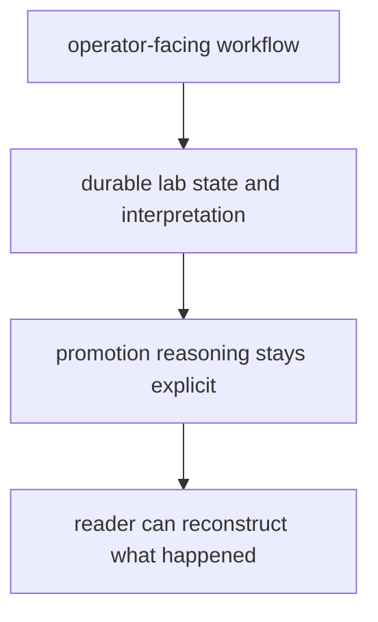

# Documentation Standards

Documentation standards should protect the reader from filler, drift, and false confidence.

For `bijux-proteomics-lab`, documentation should read like operator-facing record guidance and show how durable state is created, interpreted, and promoted.

## Documentation Model

This page should stop lab docs from sounding generic. The job is to make the durable record and its interpretation legible to an operator under pressure.

## Review Rules

- docs should sound like operator-facing record guidance, not generic package filler
- examples should show how durable lab state is created and interpreted
- quality pages should mention promotion reasoning directly

## First Proof Check

- `packages/bijux-proteomics-lab/tests`
- `src/bijux_proteomics_lab/planning/assays.py`, `planning/scheduling.py`, and `outcomes/observations.py`
- `src/bijux_proteomics_lab/reconciliation/follow_up.py` and `serialization.py`

## Design Pressure

The easy failure is to describe workflows pleasantly while leaving the promotion rationale and record interpretation too implicit for real operator use.
