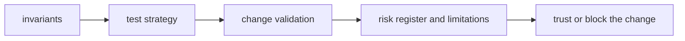

# Quality

`bijux-proteomics-lab` quality should tell a reviewer what must remain true, what proof is required, and which risks are serious enough to block a change.

## Trust Model

This page should make lab quality about durable planning and outcomes, not just
execution success. The package stays trustworthy when planning state, outcome
state, and persistence behavior remain reviewable and distinct from upstream
policy.

## Start With

- open [Invariants](https://bijux.io/bijux-proteomics/07-bijux-proteomics-lab/quality/invariants/) before changing package meaning
- open [Change Validation](https://bijux.io/bijux-proteomics/07-bijux-proteomics-lab/quality/change-validation/) when you need the minimum proof for a real edit
- open [Risk Register](https://bijux.io/bijux-proteomics/07-bijux-proteomics-lab/quality/risk-register/) when the package boundary feels under pressure

## Section Pages

- [Invariants](https://bijux.io/bijux-proteomics/07-bijux-proteomics-lab/quality/invariants/)
- [Test Strategy](https://bijux.io/bijux-proteomics/07-bijux-proteomics-lab/quality/test-strategy/)
- [Change Validation](https://bijux.io/bijux-proteomics/07-bijux-proteomics-lab/quality/change-validation/)
- [Definition of Done](https://bijux.io/bijux-proteomics/07-bijux-proteomics-lab/quality/definition-of-done/)
- [Dependency Governance](https://bijux.io/bijux-proteomics/07-bijux-proteomics-lab/quality/dependency-governance/)
- [Documentation Standards](https://bijux.io/bijux-proteomics/07-bijux-proteomics-lab/quality/documentation-standards/)
- [Known Limitations](https://bijux.io/bijux-proteomics/07-bijux-proteomics-lab/quality/known-limitations/)
- [Review Checklist](https://bijux.io/bijux-proteomics/07-bijux-proteomics-lab/quality/review-checklist/)
- [Risk Register](https://bijux.io/bijux-proteomics/07-bijux-proteomics-lab/quality/risk-register/)

## What Quality Means Here

- proving that planning and outcome state remain durable, reviewable, and distinct from upstream policy

## First Proof Check

- `packages/bijux-proteomics-lab/tests`
- `src/bijux_proteomics_lab/planning.py` and `outcomes.py`
- `src/bijux_proteomics_lab/repositories.py` and `serialization.py`

## Design Pressure

Lab quality fails when outcome state becomes easier to mutate than to explain.
The section has to keep planning, persistence, and downstream review in the
same trust story.
