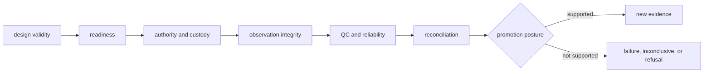

# Laboratory quality

Lab quality is the ability to prevent under-specified work from becoming an
instruction and to preserve what happened after authorized execution. It joins
design validity, readiness, custody, QC, refusal, reconciliation, and
append-only outcome history.

## Quality dimensions

| Dimension | Evidence | Blocking failure |
| --- | --- | --- |
| design | measurable endpoint, controls, power advice, randomization and blocking | assay cannot answer the stated question |
| readiness | sample, material, instrument, staffing, budget, risk, provenance | missing prerequisite hidden by a ready status |
| authority and custody | owner, approval, handoff identity, instructions, transfer record | advisory plan treated as authorization |
| schedule integrity | ready-only queue, compatibility constraints, stable policy | priority bypasses controls or readiness |
| observation | plan-linked measurements, missingness, deviations, failures | values detached from assay or batch identity |
| QC and reliability | acceptance criteria, controls, reproducibility, failure class | completed work promoted despite failed QC |
| reconciliation | requested-versus-observed disposition and next action | interpretation overwrites the measured record |
| feedback | append-only Knowledge and policy handoff | later outcome rewrites earlier decisions |

## Proof by change type

| Change | Minimum proof |
| --- | --- |
| assay or protocol model | valid, incomplete, incompatible, control and acceptance cases |
| readiness rule | pass, block, conditional, refusal, missing evidence and safe next action |
| queue or scheduling policy | capacity, priority, incompatibility, stable ordering, ready-only admission |
| handoff or export | authority, provenance, risk, round trip, external rejection |
| outcome model | observation, missingness, deviation, QC failure, reliability, identity |
| reconciliation or promotion | supported, weakened, rejected, inconclusive, rerun, no-promotion cases |

[Test strategy](test-strategy.md) and [change validation](change-validation.md)
map these obligations to executable checks.

## Invariants

- advisory and executable plans remain distinguishable;
- readiness is conditional on declared evidence and operational inputs;
- priority and schedule never override missing controls or authority;
- handoffs preserve plan identity, custody, risk, and blockers;
- observations remain separate from interpretation and promotion;
- failed QC, refusal, and inconclusive results are durable outcomes;
- feedback appends evidence without rewriting upstream history.

See [invariants](invariants.md) for the complete contract.

## Realistic negative paths

Quality evidence includes exhausted material, absent controls, unavailable
instrument time, incompatible batch members, authorization gaps, partial
observations, failed QC, deviations, contradictory outcomes, and an inability
to answer the requested question. A rehearsal that exercises only a successful
handoff cannot support production-readiness language.

Operational and scientific limits remain in [known limitations](known-limitations.md).
Unclosed ownership, safety, and promotion risks remain in the
[risk register](risk-register.md).

## Review route

Use [dependency governance](dependency-governance.md) for external integration
and optional dependencies, [documentation standards](documentation-standards.md)
for readiness and consequence claims, and [review checklist](review-checklist.md)
before handoff. [Definition of done](definition-of-done.md) requires evidence
for refusal, failure, and inconclusive outcomes as well as success.
