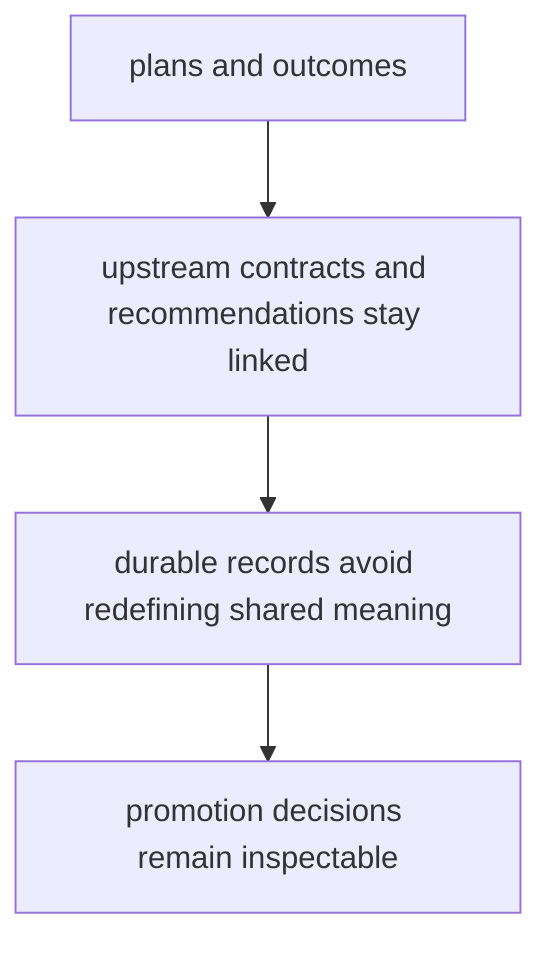

# Invariants

Invariants are the claims that must remain true for the package to stay worth trusting.

For `bijux-proteomics-lab`, the invariants keep planning, outcomes, and promotion tied to upstream contracts without letting durable records redefine shared meaning.

## Invariant Model

This page should make the lab trust boundary concrete. The package stays reliable when it records and promotes work clearly without acting like the owner of the upstream semantics it receives.

## Review Rules

- plans and outcomes must preserve their link to upstream contracts and recommendations
- lab records should stay durable without redefining shared meaning
- promotion decisions must remain inspectable after the fact

## First Proof Check

- `packages/bijux-proteomics-lab/tests`
- `src/bijux_proteomics_lab/planning.py` and `outcomes.py`
- `src/bijux_proteomics_lab/repositories.py` and `serialization.py`

## Design Pressure

The easy failure is to keep records durable while letting the link back to upstream contracts and promotion reasoning grow fuzzy.
