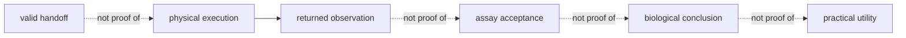

# Known limitations

Lab makes planning, readiness, custody, observations, and promotion reviewable.
It does not control physical instruments, guarantee upstream recommendation
quality, or turn a well-formed record into a complete scientific answer.

## Operational and scientific limits

| Limitation | Consequence | Responsible interpretation |
| --- | --- | --- |
| physical bench and instrument execution occur outside the package | handoff success is not proof that work ran as instructed | require returned observation, custody, and deviation evidence |
| readiness evaluates declared resources and evidence | undeclared staffing, maintenance, contamination, logistics, or local policy can still block work | record the site-specific readiness inputs and review time |
| LIMS and vendor targets differ in representational power | export can flatten or omit constraints even when serialization succeeds | publish mapping, validation, and loss reports |
| assay design uses explicit assumptions and available context | power advice and controls can be wrong for unmodeled variance or biology | preserve assumptions and require domain review |
| queue and scheduling models cover declared capacity and compatibility | real disruptions can invalidate an otherwise stable schedule | re-evaluate readiness before handoff |
| returned observations depend on external measurement and custody quality | a precise stored value can still be biased, mislabeled, or incomplete | inspect controls, lineage, deviations, missingness, and QC |
| acceptance rules are assay-specific | passing technical QC does not establish biological causality or utility | separate technical acceptance from downstream interpretation |
| promotion policy operates on available evidence | later contradiction can weaken a promoted claim without erasing history | append the new evidence and reconciliation record |

## Boundary of a successful record

Each transition needs distinct evidence. The package preserves those
transitions so callers do not infer the next state from the previous one.

## Report the operating envelope

Name site and time context where relevant, readiness inputs, controls,
authority, external system and mapping version, observation completeness,
deviations, QC rule, reliability, and promotion policy. When physical
execution evidence is absent, describe the artifact as a plan or handoff—not a
completed experiment.
