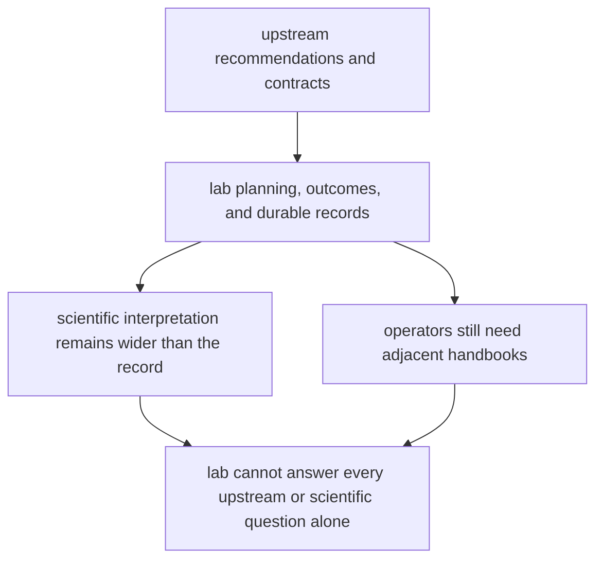

# Known Limitations

Known limitations matter because honest boundaries are part of quality, not an admission of failure.

For `bijux-proteomics-lab`, limitations are mostly about dependence on upstream recommendations and the difference between a precise record and a complete scientific answer.

## Limitation Model

This page should keep the lab boundary honest. The package can preserve what happened and what was promoted, but it cannot replace upstream reasoning or the broader scientific context around the record.

## Review Rules

- lab quality still depends on upstream recommendation and contract quality
- persisted records can be precise without answering every scientific question
- operators still need adjacent handbooks when failures originate upstream

## First Proof Check

- `packages/bijux-proteomics-lab/tests`
- `src/bijux_proteomics_lab/planning/assays.py`, `planning/scheduling.py`, and `outcomes/observations.py`
- `src/bijux_proteomics_lab/reconciliation/follow_up.py` and `serialization.py`

## Design Pressure

The easy mistake is to over-read durable records as complete scientific explanation instead of one trustworthy layer inside a larger system story.
