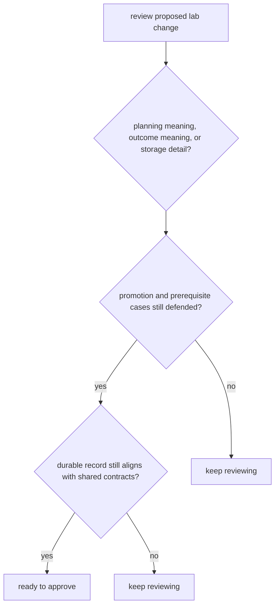

# Review Checklist

A review checklist is useful only if it catches the real ways this package can drift.

For `bijux-proteomics-lab`, review has to separate workflow convenience from durable operator truth. A fast lab-facing change is still wrong if the record becomes harder to reconstruct.

## Review Model

This checklist is useful only if it catches when operator-facing clarity is being traded away for implementation convenience.

## Review Rules

- ask whether the change alters planning meaning, outcome meaning, or only storage detail
- check promotion and prerequisite examples before approval
- verify that durable records still align with shared contracts

## First Proof Check

- `packages/bijux-proteomics-lab/tests`
- `src/bijux_proteomics_lab/planning/assays.py`, `planning/scheduling.py`, and `outcomes/observations.py`
- `src/bijux_proteomics_lab/reconciliation/follow_up.py` and `serialization.py`

## Design Pressure

The easy mistake is to approve a change because the assay loop still runs, while the planning history or promotion path has become harder to explain after the fact.
