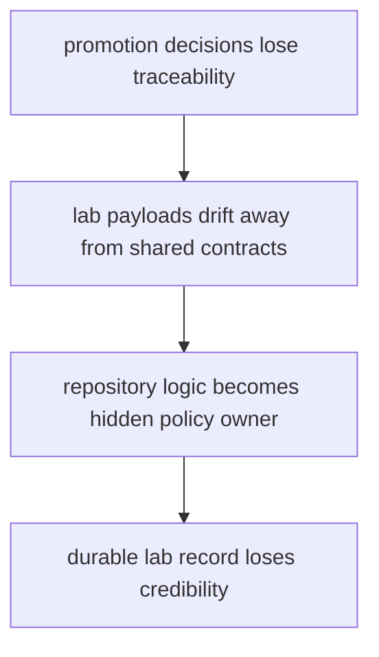
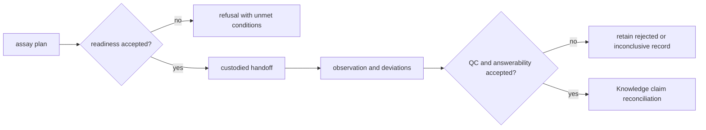

# Risk Register

The Lab risk register follows failures that can waste material, obscure assay
interpretation, break custody, or move scientific and operational authority
into implementation helpers. Each risk has an observable signal and a
containment response.

## Risk Model

The failure chain is cumulative: a weak plan can produce an apparently clean
handoff, a clean handoff can produce an uninterpretable observation, and an
unreviewed observation can be promoted into a false biological conclusion.

## Active risk controls

| Risk | Early signal | Containment | Closure evidence |
| --- | --- | --- | --- |
| readiness bypass | executable plan exists without complete controls, materials, ownership, or answerability | refuse handoff and return unmet conditions | readiness decision passes against the exact plan revision |
| custody break | sample, protocol, operator, or observation identity cannot be joined through parent records | stop progression and preserve the last valid custody point | immutable handoff and observation lineage reconcile |
| QC promotion | rejected or inconclusive measurement appears in a support claim | quarantine the promotion route; retain the observation disposition | Knowledge consumes only an accepted, scoped observation |
| hidden policy | scheduling, serialization, or repository helper selects scientific meaning | move the rule to the owning domain contract | ownership test and explicit policy record replace the helper branch |
| contract fork | Lab payload duplicates Foundation, Core, or Knowledge meaning | stop new writes and define one canonical owner | migration and compatibility evidence cover existing records |
| resource consequence loss | failure record omits consumed material, time, or capacity | block retry planning | consequence record accounts for consumed and recoverable resources |

## First proof route

Start with `packages/bijux-proteomics-lab/tests`, then trace the affected
record through `planning/assays.py`, `planning/scheduling.py`,
`outcomes/observations.py`, `reconciliation/follow_up.py`, and
`serialization.py`. Verify both the successful progression and the earliest
safe refusal.

## Design Pressure

The most dangerous drift is a helper that appears to format or route a record
but also decides readiness, scientific acceptance, or promotion. Those
decisions require explicit owners, inputs, outcomes, and reason codes.
