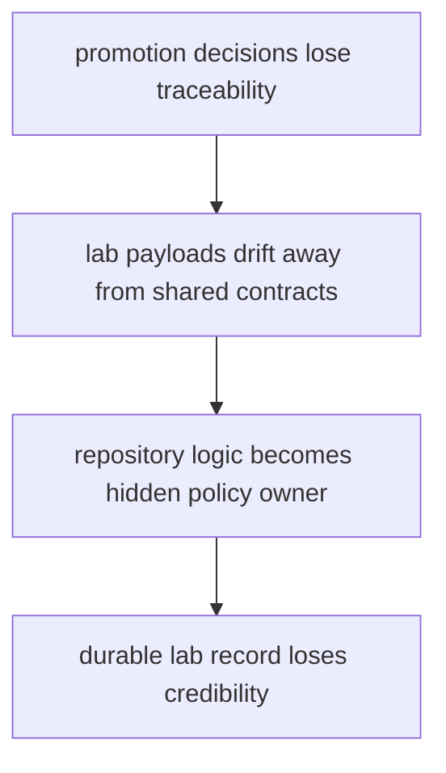

# Risk Register

A risk register should name the structural and behavioral failures that deserve ongoing attention.

For `bijux-proteomics-lab`, the serious risks are the ones that make lab records harder to trust or quietly move policy ownership into repository logic.

## Risk Model

This page should keep the lab failure chain visible. A local shortcut becomes dangerous when it weakens the record and silently relocates the real decision logic.

## Review Rules

- promotion decisions lose traceability
- lab payloads fork away from shared contracts
- repository logic quietly becomes the real policy owner

## First Proof Check

- `packages/bijux-proteomics-lab/tests`
- `src/bijux_proteomics_lab/planning/assays.py`, `planning/scheduling.py`, and `outcomes/observations.py`
- `src/bijux_proteomics_lab/reconciliation/follow_up.py` and `serialization.py`

## Design Pressure

The common drift is to treat repository helpers as harmless plumbing while they slowly become the place where policy actually lives.
