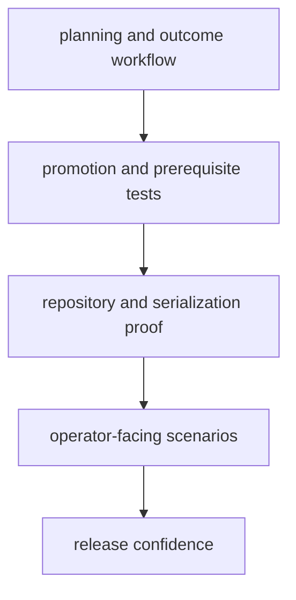

# Test Strategy

A useful test strategy names what evidence is needed and why shallow coverage is not enough.

For `bijux-proteomics-lab`, the test story should show how planning intent, outcome capture, and durable records stay aligned under real operator pressure.

## Strategy Model

This page should show why lab tests are not generic workflow checks. They are there to prove that durable records and operator decisions still tell the same story after change.

## Review Rules

- favor planning, promotion, repository, and serialization proof over generic coverage claims
- cover dependency and prerequisite cases that operators actually hit
- treat persisted lab records as first-class quality surfaces

## First Proof Check

- `packages/bijux-proteomics-lab/tests`
- `src/bijux_proteomics_lab/planning/assays.py`, `planning/scheduling.py`, and `outcomes/observations.py`
- `src/bijux_proteomics_lab/reconciliation/follow_up.py` and `serialization.py`

## Design Pressure

The easy mistake is to validate successful execution while leaving promotion history, prerequisite handling, or record meaning underexplained.
