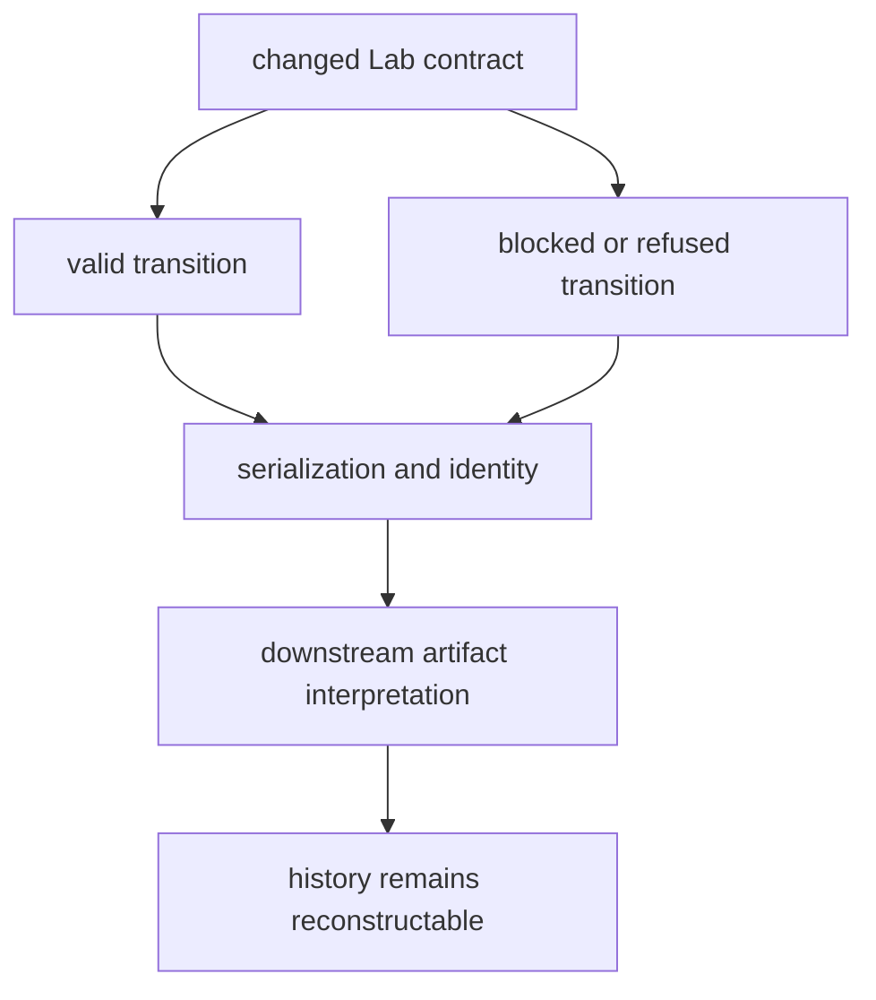

# Test strategy

Lab testing proves every transition and every refusal in the path from evidence
need to follow-up. A successful planning or handoff scenario does not establish
readiness, physical execution, QC acceptance, or evidence promotion.

## Evidence layers

| Layer | Contract under test | Representative suite |
| --- | --- | --- |
| design | endpoints, contrasts, controls, replication, blocking, protocols, dependencies, and acceptance | `tests/design/` |
| planning | assay construction, priorities, queue, batching, scheduling, stable order, and deferred work | `tests/planning/` |
| readiness | resources, capacity, staffing, budget, risk, provenance, controls, conditional and blocked outcomes | `tests/readiness/` |
| handoff | authority, custody, instructions, artifact identity, target mapping, loss, rejection, and round trip | `tests/handoffs/` |
| observation | plan linkage, values, missingness, deviations, failure class, and immutable record | `tests/outcomes/` |
| QC and reliability | acceptance rules, controls, dispersion, reproducibility, partial and failed results | outcome and benchmark tests |
| reconciliation | requested/observed delta, rerun, redesign, hold, promotion, and history | `tests/reconciliation/` |
| package boundary | Foundation primitives, Core signatures, Knowledge grounding, Intelligence feedback, Runtime output | `tests/package/` |

## Transition proof



Run the focused lifecycle family first, then the complete package suite for
public models, handoffs, persistence, or cross-package changes:

```bash
uv run --project packages/bijux-proteomics-lab \
  pytest -q packages/bijux-proteomics-lab/tests
```

## Required operational pressure

Include missing controls, exhausted material, unavailable instrument, capacity
conflict, incompatible batch, absent authority, target-system rejection,
partial observation, deviation, failed QC, irreproducibility, biological
non-support, inconclusive outcome, and promotion refusal.

Tests stop at the package boundary: they can validate a handoff and a returned
observation contract, but they cannot prove physical instrument execution
unless independent external evidence is supplied and linked.
