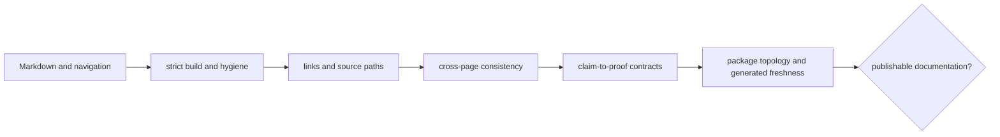
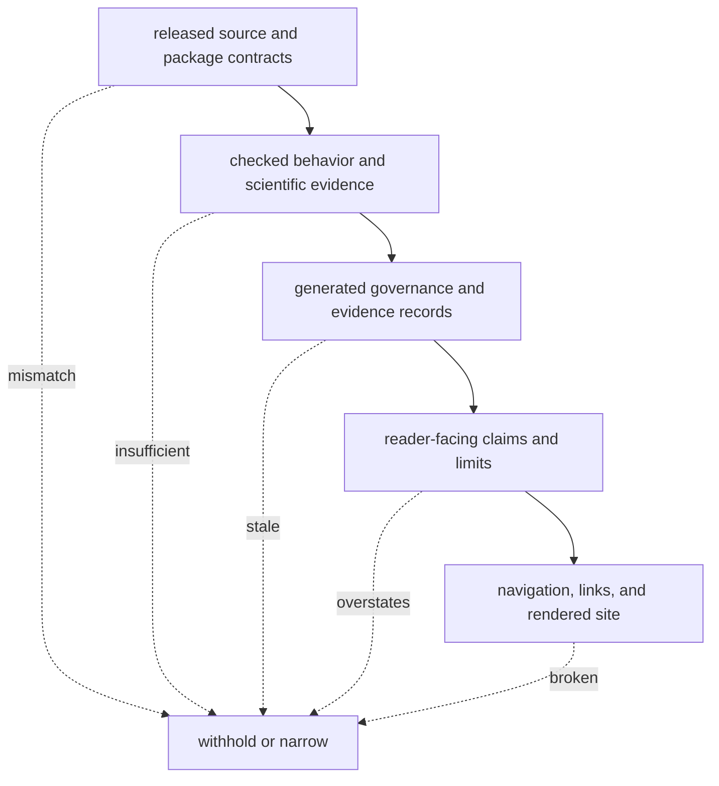

# Documentation integrity

Documentation integrity joins rendering, navigation, source paths, public claim
proof, package topology, and generated-page freshness. A successful MkDocs
build is one layer, not the complete truth contract.

## Gate architecture



| Gate | Detects | Does not prove |
| --- | --- | --- |
| `make docs-check` | synchronized source, configured build, hygiene, strict rendering | scientific accuracy of every sentence |
| `make quality-docs-links` | broken Markdown and configured link targets | that the destination supports the claim |
| `make quality-docs-consistency` | governed cross-page and vocabulary drift | runtime behavior |
| claim-proof guards | missing package evidence for governed public claims | quality of evidence outside the configured contract |
| source-path integrity | references to missing or invalid repository paths | semantic correctness of referenced source |
| topology guards | package/section ownership and navigation mismatches | completeness of every page |
| generated-doc checks | handwritten output drift from its generator | correctness of generator inputs |

## Documentation Truth Hierarchy

Later layers depend on earlier layers and may only narrow their conclusion:



A successful render establishes only that the final representation is
well-formed. It cannot repair a stale generated record, an unsupported claim,
or a missing runtime artifact. Conversely, a strong evidence packet is not
publicly usable when navigation or source-path integrity prevents independent
inspection.

## Audit One Claim

For every claim that can change a user's scientific or operational decision:

1. quote the exact sentence and identify its owning workflow or package;
2. classify the claim as behavior, execution, scientific acceptance,
   grounding, recommendation, consequence, or release language;
3. resolve the named proof artifact and confirm that its revision matches the
   documented candidate;
4. inspect contradictory and limiting records, not only supporting evidence;
5. compare the sentence with the permitted machine-readable status;
6. narrow or remove the sentence when any required link is missing.

Links establish reachability, not entailment. The destination must support the
exact proposition at the documented scope and strength.

## Reader-facing rules

- describe released behavior and current limits, not intended documentation;
- route every behavioral claim to its package owner and proof surface;
- distinguish imported, native, executable, accepted, grounded, recommended,
  ready, observed, and promoted states;
- keep failures and blocked release posture visible;
- use diagrams for ownership, flow, lifecycle, and evidence relationships;
- avoid copy-pasted package templates that conceal domain differences; and
- update generators rather than hand-editing governed outputs.

## Validation route

```bash
make docs-check
make quality-docs-links
make quality-docs-consistency
uv run --project packages/bijux-proteomics-dev \
  pytest -q packages/bijux-proteomics-dev/tests/docs
```

Inspect the worktree after commands that synchronize or generate docs. A clean
check must not leave unreviewed output behind.

## Failure record

Record the failing path, rule, command, and whether the defect is syntax,
navigation, stale generation, source ownership, or unsupported claim. Narrow
the claim when evidence is absent; do not weaken the guard to preserve prose.
