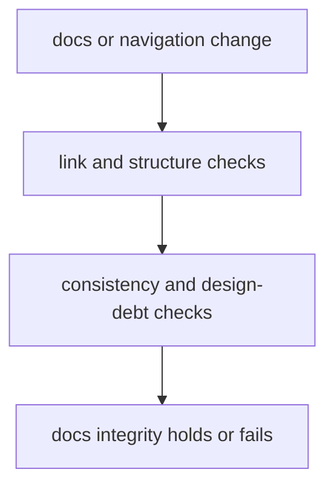

# Documentation Integrity

Documentation integrity is a repository rule here because public handbooks fail quickly when links, structure, and consistency drift.

## Integrity Model

This page should make docs integrity feel like executable publishing policy, not just tidy handbook upkeep. The repository stays readable only while broken links, structure drift, and design debt stay automatically visible.

## Integrity Rules

- keep link, structure, and consistency checks automatic and reviewable
- prefer a failing docs rule over silent handbook decay
- treat docs debt as repository-health debt, not optional polish

## First Proof Check

- `src/bijux_proteomics_dev/docs/markdown_links.py`
- `src/bijux_proteomics_dev/docs/consistency.py`
- `src/bijux_proteomics_dev/docs/design_debt.py`

## Design Pressure

The common drift is to tolerate small docs inconsistencies until the public handbook stops behaving like one coherent site.
