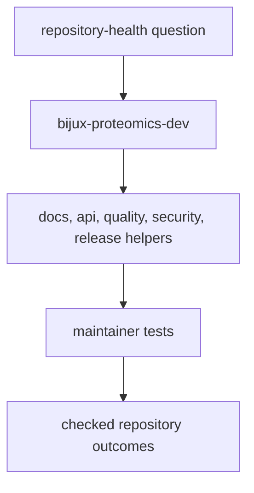

# bijux-proteomics-dev

`bijux-proteomics-dev` is where repository discipline becomes executable code.
This section exists so a maintainer can trace a docs rule, API guard, quality
gate, release check, or security policy back to a checked-in Python owner
instead of relying on folklore.

This section should let a maintainer trace a repository rule back to the exact helper family and then to the tests that keep that rule honest. If it cannot do that, the package is still behaving like implicit CI folklore.

## What This Package Proves

- repository rules are code, not just conventions written in Markdown
- maintainers can change policy with reviewable ownership and tests
- docs quality, release safety, and schema discipline share one explicit toolkit
- release posture, docs honesty, and API proof checks are inspectable surfaces
  instead of hidden CI trivia

## Start With

- open [Module Map](https://bijux.io/bijux-proteomics/08-bijux-proteomics-maintain/bijux-proteomics-dev/module-map/)
  when you need the owning helper family immediately
- open [Quality Gates](https://bijux.io/bijux-proteomics/08-bijux-proteomics-maintain/bijux-proteomics-dev/quality-gates/),
  [Security Gates](https://bijux.io/bijux-proteomics/08-bijux-proteomics-maintain/bijux-proteomics-dev/security-gates/),
  or [Documentation Integrity](https://bijux.io/bijux-proteomics/08-bijux-proteomics-maintain/bijux-proteomics-dev/documentation-integrity/)
  when the symptom is already blocking work
- open [Package Overview](https://bijux.io/bijux-proteomics/08-bijux-proteomics-maintain/bijux-proteomics-dev/package-overview/)
  and [Operating Guidelines](https://bijux.io/bijux-proteomics/08-bijux-proteomics-maintain/bijux-proteomics-dev/operating-guidelines/)
  when the question is where maintainer code should live at all

## Reader Questions This Package Can Answer

- which exact helper family owns a failing docs, release, security, or API
  contract
- whether a repository rule is enforced by executable checks or only repeated
  in prose
- where a maintainer should extend tooling without accidentally swallowing
  product-domain code
- how to trace a release or documentation expectation back to the checked test
  surface that keeps it honest

## Read By Responsibility

- [Schema Governance](https://bijux.io/bijux-proteomics/08-bijux-proteomics-maintain/bijux-proteomics-dev/schema-governance/)
  for `api/` ownership and contract drift control
- [Release Support](https://bijux.io/bijux-proteomics/08-bijux-proteomics-maintain/bijux-proteomics-dev/release-support/)
  for trusted publication guards and version checks
- [Documentation Integrity](https://bijux.io/bijux-proteomics/08-bijux-proteomics-maintain/bijux-proteomics-dev/documentation-integrity/)
  for architecture docs, badge sync, and consistency enforcement
- [Scope and Non-Goals](https://bijux.io/bijux-proteomics/08-bijux-proteomics-maintain/bijux-proteomics-dev/scope-and-non-goals/)
  to keep the toolkit from swallowing product code

## Why This Package Matters More Than It Looks

- the rest of the repository can only present itself honestly if this package
  keeps documentation, release, and contract surfaces verifiable
- stronger scientific and runtime depth increase the cost of weak maintainer
  tooling because bad checks can distort public claims
- this package is the proof that repository discipline is engineered, not
  performative

## Maintainer Proof Surfaces

- module map for helper-family ownership before touching code
- documentation integrity for reader-facing honesty, navigation, and badge
  sync expectations
- release support for publishable version, changelog, and artifact gates
- schema governance and quality gates when a package-facing contract or API
  claim is changing

## First Proof Check

- `src/bijux_proteomics_dev/docs/`
- `src/bijux_proteomics_dev/governance/`, `release/`, `security/`, and `quality/`
- `packages/bijux-proteomics-dev/tests`
- checked documentation, release, and contract tests when a maintainer claim
  needs proof rather than habit

## Design Pressure

The easy failure is to treat maintainer helpers as one black box, which makes it hard to see which family owns a broken repository rule or why.
