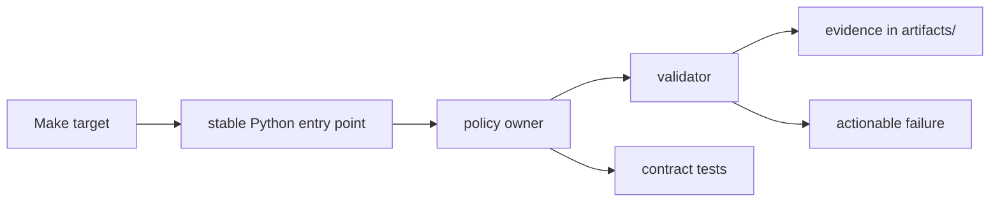
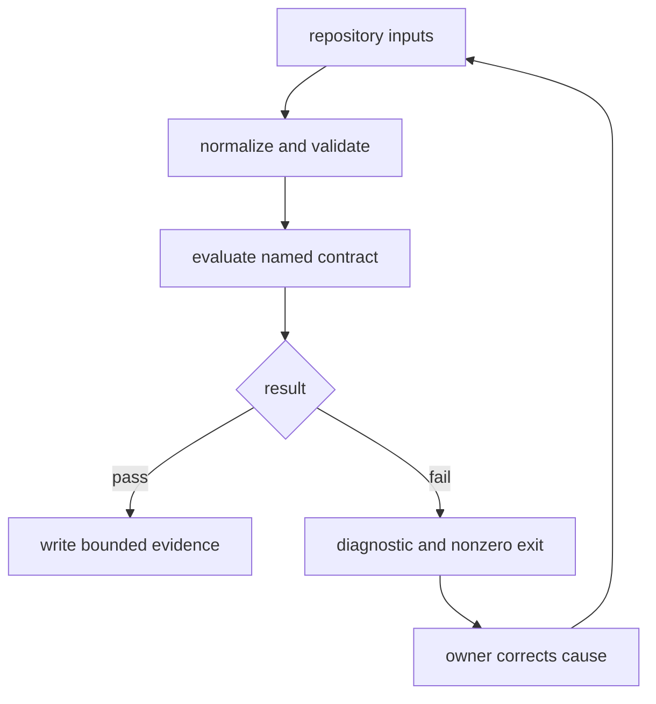

# bijux-proteomics-dev

`bijux-proteomics-dev` implements repository policy as versioned, tested Python
instead of embedding it in shell fragments or CI-only behavior. It owns
validators for documentation, APIs and schemas, architecture, security,
quality, governance, compatibility, and release evidence.

Make targets provide stable operator commands; this package carries the policy
and implementation behind them. The split keeps orchestration readable while
allowing validators to have typed inputs, unit tests, and reusable failure
reports.

## Route by responsibility

| Concern | Guide | Expected owner |
| --- | --- | --- |
| find a validator or helper family | [Module map](module-map.md) | one durable Python module family |
| choose checks for a change | [Quality gates](quality-gates.md) | explicit gate and evidence contract |
| protect API and schema evolution | [Schema governance](schema-governance.md) | lock, compatibility, and generated evidence owners |
| validate public documentation | [Documentation integrity](documentation-integrity.md) | links, structure, claims, badges, and build checks |
| evaluate dependency or code risk | [Security gates](security-gates.md) | static, vulnerability, policy, and allowlist checks |
| prepare publication | [Release support](release-support.md) | build, identity, version, artifact, and preflight checks |
| make a repository-safe change | [Maintainer safe change](maintainer-safe-change.md) | scoped edit, affected gates, coherent commit |
| decide whether code belongs here | [Scope and non-goals](scope-and-non-goals.md) | repository policy rather than product behavior |

The [package overview](package-overview.md) and
[package substance](package-substance.md) describe the implemented surface.
[Operating guidelines](operating-guidelines.md) govern extensions and failure
behavior.

## Validator contract

Every repository validator needs:

1. a stable command entry point;
2. a clearly owned policy input;
3. deterministic repository discovery and output location;
4. success and failure tests, including malformed and missing inputs;
5. actionable diagnostics identifying the violated contract and evidence;
6. a nonzero exit status on failure;
7. documented scope and known limits.

A validator must not rewrite the input to make it conform, catch and discard a
failure, or report success when a required tool is missing. Remediation belongs
to an explicit owner command and remains separate from verification whenever
the two actions can be reviewed independently.

## Policy ownership

Product packages own scientific and runtime behavior. `bijux-proteomics-dev`
may inspect those packages against repository contracts, but it does not become
the source of truth for their domain models. Conversely, CI workflows call
maintainer commands; they do not carry independent copies of validation policy.

This creates a traceable chain:

- the Make target names the operator contract;
- the package module owns policy evaluation;
- package tests exercise positive and negative behavior;
- CI repeats the command in a clean environment;
- evidence and failures remain available for review.

## Failure discipline

Failures identify the exact contract, subject, expected condition, observed
condition, and remediation owner whenever possible. Existing blockers remain
visible and distinguishable from regressions introduced by a change. A missing
dependency, stale generated artifact, empty test collection, or skipped
required surface is not a passing result.

Generated logs and reports belong under `artifacts/` unless the command
explicitly governs a tracked repository output. Handwritten policy and
generated evidence are reviewed and committed separately when they are not
inseparable for correctness.
