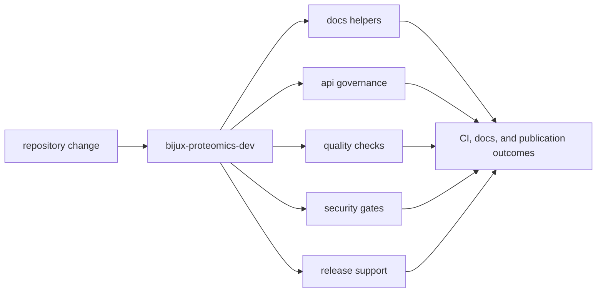

# bijux-proteomics-dev

`bijux-proteomics-dev` is where repository discipline becomes executable code.
This section exists so a maintainer can trace a docs rule, API guard, quality
gate, release check, or security policy back to a checked-in Python owner
instead of relying on folklore.

## What This Package Proves

- repository rules are code, not just conventions written in Markdown
- maintainers can change policy with reviewable ownership and tests
- docs quality, release safety, and schema discipline share one explicit toolkit

## Start With

- open [Module Map](https://bijux.io/bijux-proteomics/08-bijux-proteomics-maintain/bijux-proteomics-dev/module-map/)
  when you need the owning helper family immediately
- open [Quality Gates](https://bijux.io/bijux-proteomics/08-bijux-proteomics-maintain/bijux-proteomics-dev/quality-gates/),
  [Security Gates](https://bijux.io/bijux-proteomics/08-bijux-proteomics-maintain/bijux-proteomics-dev/security-gates/),
  or [Documentation Integrity](https://bijux.io/bijux-proteomics/08-bijux-proteomics-maintain/bijux-proteomics-dev/documentation-integrity/)
  when the symptom is already blocking work
- open [Package Overview](https://bijux.io/bijux-proteomics/08-bijux-proteomics-maintain/bijux-proteomics-dev/package-overview/)
  and [Operating Guidelines](https://bijux.io/bijux-proteomics/08-bijux-proteomics-maintain/bijux-proteomics-dev/operating-guidelines/)
  when the question is where maintainer code should live at all

## Read By Responsibility

- [Schema Governance](https://bijux.io/bijux-proteomics/08-bijux-proteomics-maintain/bijux-proteomics-dev/schema-governance/)
  for `api/` ownership and contract drift control
- [Release Support](https://bijux.io/bijux-proteomics/08-bijux-proteomics-maintain/bijux-proteomics-dev/release-support/)
  for trusted publication guards and version checks
- [Documentation Integrity](https://bijux.io/bijux-proteomics/08-bijux-proteomics-maintain/bijux-proteomics-dev/documentation-integrity/)
  for architecture docs, badge sync, and consistency enforcement
- [Scope and Non-Goals](https://bijux.io/bijux-proteomics/08-bijux-proteomics-maintain/bijux-proteomics-dev/scope-and-non-goals/)
  to keep the toolkit from swallowing product code

## First Proof Check

- `src/bijux_proteomics_dev/docs/`
- `src/bijux_proteomics_dev/api/`, `release/`, `security/`, and `quality/`
- `packages/bijux-proteomics-dev/tests`
