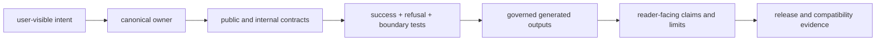

# Maintainer Safe Change

A safe repository change preserves ownership, public behavior, generated
authority, and reviewable evidence together. Passing the nearest unit test is
necessary, but it is not sufficient when the change crosses packages, schemas,
artifacts, compatibility routes, documentation, or release claims.

## Classify The Contract

Start with [Cross-Package Ownership](../../01-bijux-proteomics/foundation/cross-package-ownership.md)
and identify every affected contract:

| Contract | Examples | Proof surface |
| --- | --- | --- |
| scientific behavior | parsing, FDR, inference, quantification, QC, acceptance | package tests plus benchmark evidence |
| portable data | identifiers, schemas, serialization, typed outcomes | Foundation contract and migration tests |
| execution | provider choice, state transitions, artifacts, replay | Runtime execution and black-box tests |
| evidence | provenance, claims, contradiction, reconciliation | Knowledge integrity and grounding tests |
| decision | ranking, challenge, downgrade, refusal | Intelligence scenario and calibration tests |
| laboratory consequence | readiness, controls, handoff, observation | Lab consequence and outcome tests |
| compatibility | imports, CLI, HTTP, configuration, serialization | parity and migration-ledger tests |
| release or public language | package metadata, generated dossiers, handbook claims | release governance and documentation checks |

If ownership is ambiguous, resolve it before implementation. Moving behavior
into a lower-level package merely to avoid a dependency is boundary drift.

## Map The Change

Record the affected package, direct consumers, public imports or commands,
schemas, artifacts, generated files, documentation routes, and release gates.
This map defines the change boundary and prevents unrelated edits from entering
the same commit.

## Change Source And Proof Together

Implementation and its narrow proof should move together:

- update success, malformed-input, refusal, and boundary tests;
- preserve stable identifiers and distinguish missing, failed, and refused
  outcomes;
- update schemas and migrations when serialized meaning changes;
- update compatibility routes only when observable behavior changes;
- route run products and logs under the repository `artifacts/` root;
- retain rejected inputs, warnings, uncertainty, and limitation records.

Use [Testing And Validation](../../01-bijux-proteomics/operations/testing-and-validation.md)
to select package and repository checks. A broad aggregate command does not
replace the narrow test that proves the changed invariant.

## Regenerate From The Owner

Do not hand-edit a generated contract to make a check pass. Change the source
generator or governed input, run the documented generation command, inspect the
semantic diff, and run check mode. Typical governed outputs include API
snapshots, package inventories, benchmark dossiers, reader routes, and release
matrices.

Keep handwritten changes and generated output in separate commits when they
express independent intent. Keep them together only when the generated
contract is inseparable from the source change.

## Review The Public Route

Open the path an actual user follows:

1. root `README.md` or documentation home;
2. product overview or workflow-family route;
3. owning package handbook;
4. interface, operation, or benchmark page;
5. known limitation, refusal, and release evidence.

The reader should not need maintainer knowledge to discover the owner, execute
the supported route, interpret artifacts, or find the claim ceiling.

## Select Release Evidence

Use [Release Support](release-support.md) and the
[Release Readiness Matrix](../../01-bijux-proteomics/foundation/release-readiness-matrix.md)
to identify the final gates. The release record must keep code revision,
environment, commands, artifacts, failures, and scientific limitations
together.

Before committing, confirm:

- focused tests and affected repository gates have known results;
- generated outputs are fresh and attributable;
- public language does not exceed benchmark, Runtime, grounding, decision, or
  Lab evidence;
- compatibility impact and removal evidence are explicit;
- only paths belonging to the durable intent are staged;
- failure output is recorded rather than bypassed or silenced.

## Stop Conditions

Stop the change from advancing when:

- package ownership or dependency direction remains unresolved;
- a public contract changes without consumer and compatibility evidence;
- a generated file is stale or its source is unknown;
- a benchmark or runtime claim lacks reproducible input and artifact identity;
- a failing check is explained away without identifying its owner and impact;
- the documentation promises behavior that the released surface cannot expose;
- the staged diff contains unrelated user work.

A blocked release with an exact reason is a stronger engineering outcome than
a green signal produced by weakening the gate.
