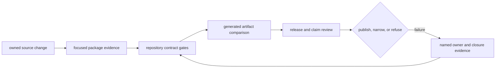
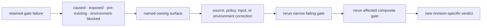

# Maintenance

`bijux-proteomics-dev` turns repository policy into executable checks. It
detects contract drift, documentation breakage, dependency and architecture
violations, unsafe release posture, and gaps between public claims and retained
evidence.

## Maintenance control loop

The loop operates on an identified revision. A result cannot move to another
commit, environment, generated input set, or policy version merely because the
command name is unchanged.

## Gate Evidence Identity

| Identity member | Why it must be retained |
| --- | --- |
| source revision and worktree state | establishes exactly which handwritten inputs were checked |
| command, target, and arguments | distinguishes narrow evidence from composite evidence |
| toolchain and environment | exposes interpreter, dependency, platform, and optional-capability differences |
| policy and governed inputs | identifies thresholds, locks, manifests, schemas, and allowlists used for the verdict |
| generated outputs and fingerprints | proves freshness and prevents evidence from another revision being substituted |
| diagnostics and disposition | preserves pass, failure, refusal, or blocked execution without narrative reinterpretation |

## Route changes to gates

| Changed surface | Focused evidence | Repository gate |
| --- | --- | --- |
| Python behavior | owning package tests, lint, typing | `make test`, `make quality` as scope requires |
| public API or schema | package contract tests and generated diff | `make api`, `make api-freeze`, `make openapi-drift` |
| imports or dependencies | package import and optionality tests | dependency, circular-import, and optional-dependency quality gates |
| documentation or navigation | affected docs tests | `make docs-check`, link and consistency gates |
| generated governance artifact | generator check mode and source diff | artifact-governance and owning release gate |
| runtime or compatibility | parity, migration, replay, and retained artifacts | Runtime boundary and migration gates |
| scientific benchmark or claim | owning family corpus and acceptance | release readiness, grounding, challenge, and consequence gates |
| packaging or publication | wheel/container inspection and install evidence | build, SBOM, release preflight |

## Evidence interpretation

| Green result | Establishes | Does not establish |
| --- | --- | --- |
| package test | covered local behavior | cross-package safety |
| static quality gate | checked source and policy constraints | runtime or scientific validity |
| documentation build | configured rendering, structure, and hygiene | truth of every public claim |
| schema freeze | governed bytes match tracked contract | compatibility of an intentional semantic change |
| replay gate | declared run can be reopened under its contract | independent scientific replication |
| release preflight | release policy for one revision | universal workflow authority |

Composite success means that each included gate passed for the same identified
candidate. It does not allow a broad gate to replace missing owner-level
evidence, or a later green rerun to erase an earlier failure without a recorded
cause and corrected revision.

## Failure handling

A pre-existing failure remains a failure. Record the exact command, revision,
affected contract, owner, whether the current change caused it, and evidence
required to close it. Do not exclude, mute, regenerate, or relabel the failing
surface merely to make a gate green.

Start with [Maintainer Safe Change](maintainer-safe-change.md) for an owned edit,
[Documentation Integrity](documentation-integrity.md) for the public site,
[Schema Governance](schema-governance.md) for contract movement, and
[Release Support](release-support.md) for publication evidence.
