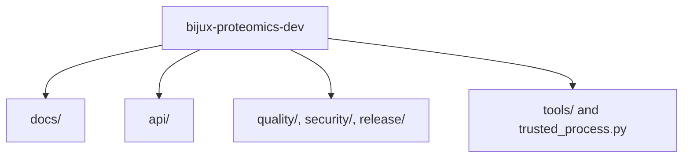

# Module Map

The maintainer package stays legible only when helper families remain separated by job.

## Module Model

This page should let a maintainer classify a helper before opening code. If every policy helper feels adjacent to every other one, the package will become hard to route and harder to review.

## Module Families

- `docs/` for documentation integrity, consistency, design debt, and badge/link checks
- `api/` for contract freezing and OpenAPI drift checks
- `release/`, `security/`, and `quality/` for publication, audit, and architecture gates
- `tools/` and `trusted_process.py` for maintainer-oriented utility workflows

## First Proof Check

- `src/bijux_proteomics_dev/docs/`
- `src/bijux_proteomics_dev/api/`, `release/`, `security/`, and `quality/`

## Design Pressure

The easy failure is to keep adding helpers without preserving family boundaries, which slowly turns the maintainer package into one vague toolbox.
