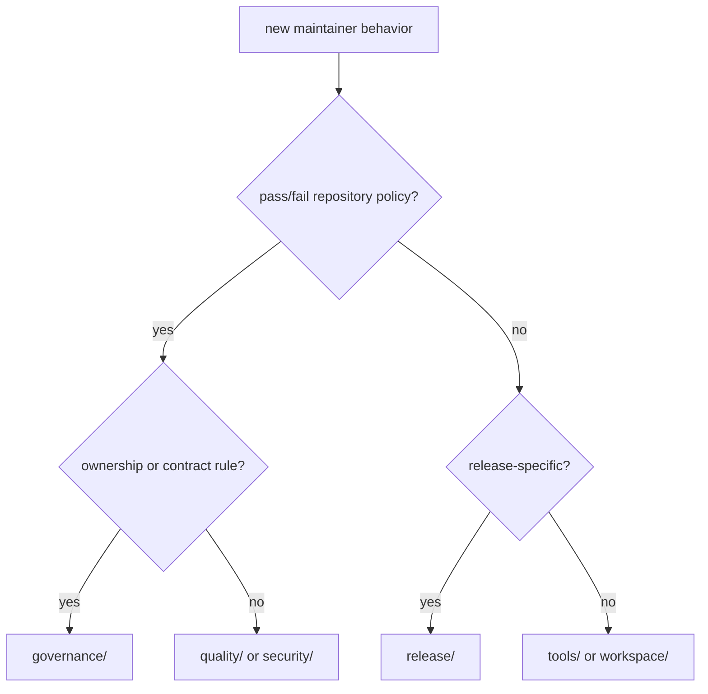

# Module map

The maintainer toolkit groups helpers by the repository property they govern.
Choose the narrowest family that owns the rule; do not add a generic utility
module when the behavior has a clear policy domain.

```text
bijux_proteomics_dev/
├── docs/          public documentation integrity and governance
├── governance/    package, contract, dependency, and ownership policy
├── quality/       architecture, artifacts, benchmarks, dependencies, and gates
├── release/       release readiness, versioning, licensing, and publication
├── security/      dependency audit and trusted process execution
├── tools/         explicit maintainer workflows
└── workspace/     repository environment and artifact layout
```

## Routing table

| Question | Module family |
| --- | --- |
| Is public documentation linked, coherent, current, and structurally valid? | `docs/` |
| Does an API, public symbol, package boundary, or dependency direction comply with policy? | `governance/` |
| Does the repository satisfy architecture, artifact, benchmark, or dependency quality? | `quality/` |
| Can the package family be versioned, licensed, built, and released safely? | `release/` |
| Are dependency and subprocess security controls satisfied? | `security/` |
| Is this an operator-triggered asset-management workflow rather than a gate? | `tools/` |
| Does the rule concern generated-output location or shared workspace setup? | `workspace/` |



## Subdomain boundaries

`governance/` is further divided by contracts, dependencies, package shape, and
canonical package ownership. `quality/` contains architecture, artifacts,
benchmarks, dependencies, graphs, and composed gates. `release/` separates
general governance from licensing and versioning.

Use these subdomains rather than expanding a root module. A helper that scans
package trees belongs with package-shape governance; one that evaluates output
placement belongs with artifact quality; one that coordinates the final release
verdict belongs with release governance.

## Dependency direction

Leaf scanners and models must not import composed release gates. Higher-level
gates may combine lower-level governance and quality results. Make and workflow
callers depend on the package; the package does not depend on repository YAML or
shell behavior for its policy semantics.

Tests mirror the owned family under `packages/bijux-proteomics-dev/tests/`.
Place fixtures with the narrowest test owner and keep generated reports beneath
`artifacts/` unless the helper intentionally governs a tracked output.
