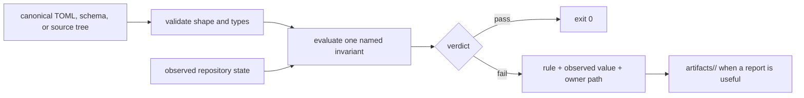

# Operating guidelines

A maintainer gate is a small executable argument: these are the authoritative
inputs, this is the invariant, and this evidence either satisfies it or does
not. Reliable gates make that argument visible in their code, tests, command
surface, and diagnostics.

## Contract before mechanism

Start with the ownership question. Identify the checked file or code surface
that defines the rule, the repository state being observed, and the team or
package that can repair a failure. A validator with no authoritative input
usually encodes maintainer folklore; a validator with two competing inputs
usually creates an authority conflict.

Prefer structured policy in `configs/`, schemas in their governed schema roots,
and code-derived observations from the package that owns them. Public MkDocs
pages explain supported behavior and evidence to readers; they are not a
machine-policy database.

## Implementation contract

Every helper should preserve these properties:

| Property | Required behavior |
| --- | --- |
| deterministic input | resolve paths from an explicit repository root or declared environment variable |
| validated parsing | reject missing files, malformed syntax, and unexpected value types |
| narrow decision | evaluate one durable invariant or one cohesive preflight |
| fail-closed default | return nonzero when required evidence cannot be read or interpreted |
| actionable diagnostics | name the violated rule, observed value, and canonical repair surface |
| stable output | keep human diagnostics concise; write detailed reports below `artifacts/` |
| safe execution | use absolute executables through the trusted-process helper when spawning processes |
| direct testing | cover success, malformed input, missing input, and meaningful boundary failures |

Do not catch broad exceptions and reinterpret them as success. Do not add an
ignore merely because an existing violation makes the gate inconvenient. An
exception needs a narrow identifier, an owner, and a durable justification in
the governing contract.

## Adding or changing a gate

1. Locate the authoritative contract and confirm that the proposed rule belongs
   to repository enforcement rather than product behavior.
2. Implement a callable that accepts an explicit root or input path. Keep CLI
   adaptation at the edge so tests can exercise the decision directly.
3. Validate input structure before comparing values. Missing evidence is not an
   empty successful result.
4. Test the valid state, absent or malformed inputs, and each refusal class that
   a maintainer must distinguish.
5. Expose the helper through one named Make target. Compose that target into
   quality, security, or release only after its standalone contract is clear.
6. Route generated reports and caches under `artifacts/`; never make a transient
   report a checked source of truth.
7. Document the public behavior, evidence, and repair route without copying
   internal control data into the reader handbook.

## Failure design

A useful failure lets a maintainer act without reading the validator first.
For collection failures, identify the missing or duplicate object. For graph
failures, show the prohibited edge. For freshness failures, name the generator
and governed output. For dependency failures, report both unapproved declared
dependencies and stale approvals.

Exit status is part of the interface:

- `0` means the complete named contract was evaluated and satisfied;
- `1` means repository state violates the contract;
- a distinct nonzero status may identify unreadable tooling input or invocation
  failure when callers need to separate infrastructure failure from a finding.

Diagnostic modes may print findings without blocking local exploration, but
they are not release evidence. CI and release preflight use strict behavior.

## Review checklist

Before accepting a gate change, verify that:

- one canonical owner defines each input;
- the helper cannot pass because an expected section or collection is absent;
- normalization does not merge scientifically or operationally distinct names;
- tests assert refusal behavior, not only the happy path;
- output paths conform to artifact governance;
- the Make or workflow caller preserves the helper's exit status;
- the change does not introduce a product dependency on the maintainer package;
- public documentation states what users can rely on without exposing internal
  policy as editable prose.
