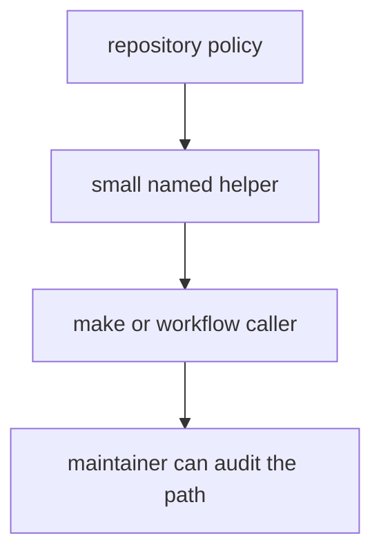

# Operating Guidelines

Maintainer helper code should stay boring in the good sense: explicit, testable, and easier to audit than the process it replaces.

## Operating Model

This page should make the coding standard for maintainer helpers visible: one named policy path, one reviewable helper, one easy-to-audit caller chain.

## Guidelines

- encode repository policy in small, named helpers
- keep maintainer automation easier to review than the workflow calling it
- move product-specific logic back to product packages when the boundary blurs

## First Proof Check

- `packages/bijux-proteomics-dev/src/bijux_proteomics_dev/`
- `packages/bijux-proteomics-dev/tests`

## Design Pressure

The common drift is to let helper code become cleverer than the workflow it replaced, which defeats the point of moving policy into code.
